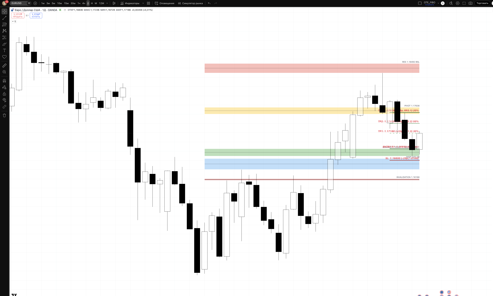
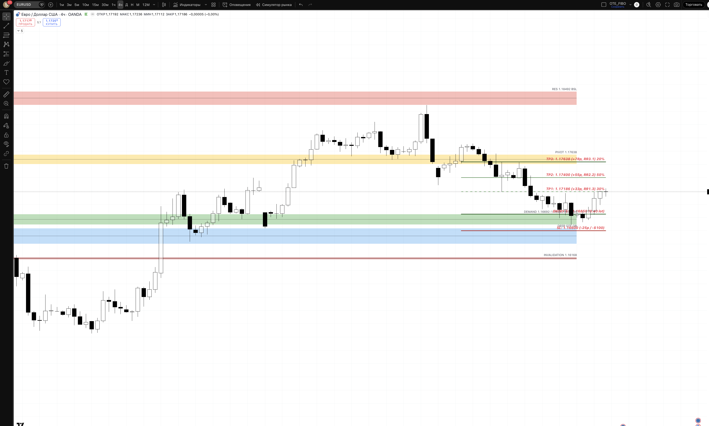
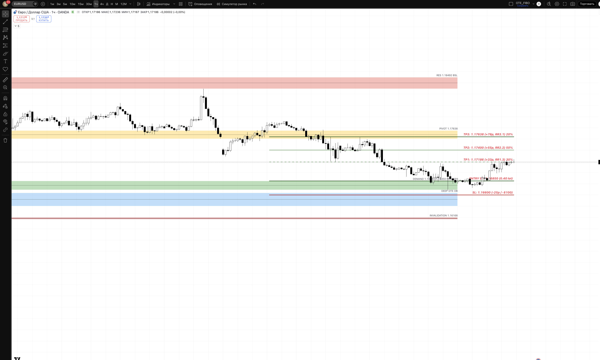
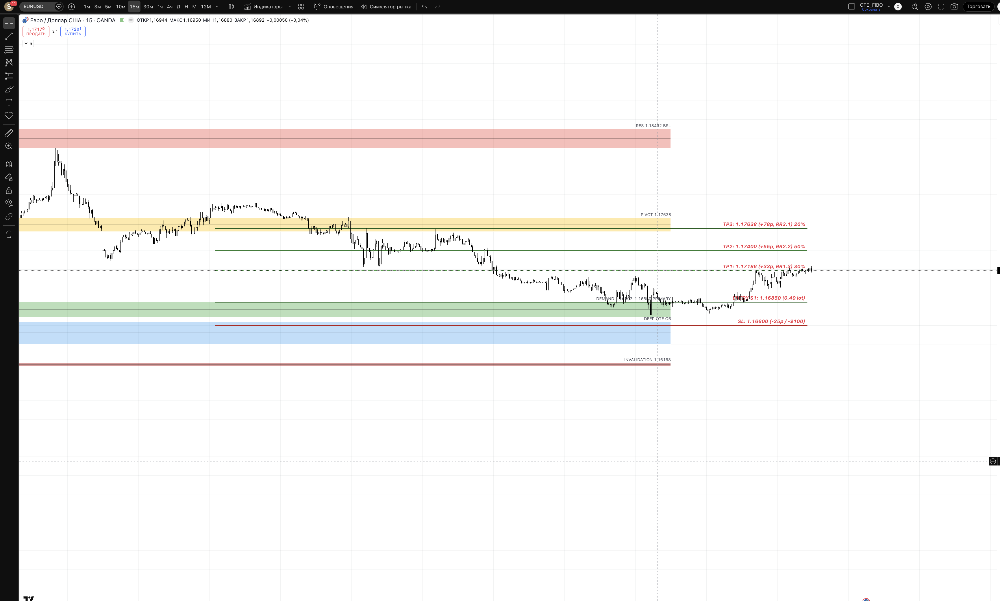

## 🎯 Пара: EURUSD | Період: 27 квіт – 1 трав 2026
**Поточна ціна (Fri close):** 1.17186
**Стиль:** ⚡ ТІЛЬКИ ДЕННА ТОРГІВЛЯ (intraday — закриття до кінця сесії)

---

## 📖 Читання ринку — що відбулось і куди рухаємось

### Звідки прийшли (контекст)

На початку квітня EURUSD зробив масштабний bullish рух — з рівня 1.14110 (реакція на тарифні побоювання, мінімум кризи) пара злетіла до 1.18492 до 10 квітня. Це +440 pips за ~10 торгових днів. Рух був аномально сильним: тижнева свічка закрилась на 1.17638, а хай тижня сягнув 1.18492 — рівень, де накопичені стопи покупців з попередніх тижнів (BSL — Buy Side Liquidity).

Досягнувши 1.18492, ринок зіткнувся з серйозним опором: тут розміщені ордери продавців з більш високих таймфреймів. Почалась корекція.

### Що відбулось минулого тижня

Чотири дні підряд ціна давала нижчі закриття:

> 1.17872 → 1.17438 → 1.17067 → 1.16827 (з мінімумом 1.16692)

Це не випадковий хаос — це організований відкат смарт-мані у зону попиту. Ціна "виполювала" стопи слабких покупців і накопичувала ліквідність під ключовим рівнем 1.16692 (попередній тижневий мінімум, SSL — Sell Side Liquidity).

**П'ятниця стала переломним моментом.** Ціна відкрилась і одразу пішла вниз — sweep нижче 1.16692, дотягнувши до інтрадей мінімуму. Це класичний "ліквідаційний штовх" перед розворотом: ринок забрав стопи у тих, хто ставив лонги на 1.167+, і одночасно спровокував ведмежих трейдерів відкривати шорти "на пробої". Після того, як ліквідності вистачило — різкий розворот, і закриття дня на 1.17186.

Добова свічка: бичий молот з довгим нижнім тіньом — типовий reversal pattern після sweep.

### Де знаходимось зараз і чому це важливо

Ціна закрила тиждень на 1.17186 — всередині між зоною попиту (1.16692–1.16850) знизу і ключовим pivot рівнем 1.17638 зверху. Це "нейтральна" зона, але контекст бичачий:

- **BOS (Break of Structure) UP** підтверджений вище 1.17638 — структура висхідна
- **HH/HL** (вищий хай, вищий лоу) на тижневому таймфреймі збережена
- Sweep SSL + bullish close = смарт-мані набрали лонги, слабкі учасники — вийшли

### Куди рухаємось далі

**Основний сценарій (60%):** ринок підтвердив накопичення в demand zone і готується до продовження bullish руху. Найближча ціль — 1.17638 (PWClose, попередній тижневий close, де раніше відбувся BOS). Після пробою 1.17638 відкривається шлях до 1.18000 (психологічний) і в перспективі — до 1.18492 (PWH/BSL — ціль для зняття ліквідності зверху).

**Умова для цього сценарію:** понеділок відкривається без різкого гепу вниз, і London KZ дає setup на вхід — або повторний sweep demand zone з BOS вверх на 5m, або continuation вище 1.17200 без заходу в demand.

**Що може змінити картину:** якщо ціна закриє H4 нижче 1.16692 — це порушить HL структуру і відкриє шлях до 1.16400 (deep OTE) і потенційно до 1.16168 (invalidation). В такому разі переходимо до сценарію C — стоїмо осторонь лонгів.

---

## 📊 Скріншоти з зонами підтримки/опору

### 🟦 Daily — HTF структура + зони

**Що бачимо на чарті:**
Повний bullish leg від 1.14110 → 1.18492 і корекція до demand zone. П'ятнична свічка — молот після sweep нижче 1.16692. Усі 5 ключових зон нанесені. Поточна ціна (1.17186) знаходиться між demand та pivot — це зона "рішення".

- 🔴 RESISTANCE 1.18492 — PWH, BSL. Сюди ринок направляється як ціль для зняття ліквідності зверху. Сильний продавець тут очікується, але не для intraday.
- 🟡 PIVOT 1.17638 — PWClose (закриття попереднього тижня), де відбувся BOS вгору. Перший серйозний бар'єр на шляху вверх. При пробої — прискорення.
- 🟢 DEMAND 1.16692–1.16850 — зона, де п'ятниця зробила sweep і розвернулась. Тут інституційні покупці накопичували позиції. PRIMARY зона для лонгів.
- 🔵 DEEP OTE 1.16400–1.16640 — D bullish OB, агресивна зона для лонгів лише при глибшому заході.
- 🔴 INVALIDATION 1.16168 — HTF структура зламана. Нижче — не торгуємо в бік лонга.

### 🟦 H4 — entry context

**Що бачимо на чарті:**
На H4 видно всі деталі sweep: чотири спадні H4 бари привели ціну до 1.16692, де виник різкий bullish reversal. Остання H4 свічка тижня закрилась вище зони demand — підтвердження що покупки реальні, не "дохлий кіт". Обсяги на розвороті помітно вищі.

Зони ідентичні Daily, але на H4 краще видно точку розвороту і реакцію ціни. Поточна ціна (1.17186) — між demand і pivot, H4 показує нерішучість: ані пробою вниз, ані активного руху вгору поки що.

### 🟢 H1 — Intraday entries

**Що бачимо на чарті:**
H1 показує всю корекційну фазу з 1.18492 вниз і ключовий момент sweep + відскок п'ятниці. Видно, як кожна H1 свічка після sweep ставала "вищим закриттям" — ознака що продавці вичерпались.

Рівні для Setup 1:
- 🟢 ENTRY 1.16850 — в зоні demand після sweep
- 🔴 SL 1.16600 — під зоною з буфером
- 🟢 TP1 1.17186 — рівень поточного close, перший бар'єр
- 🟢 TP2 1.17400 — кластер H1 опору
- 🟢 TP3 1.17638 — pivot/PWClose, головна ціль тижня

### ⚡ M15 — Trigger TF

**Що бачимо на чарті:**
M15 показує механіку sweep: різка свічка вниз через 1.16692 з довгим фітилем, і потім серія bullish свічок — ChoCH (Change of Character). Саме на M15 чекаємо trigger для входу в понеділок: спочатку sweep під 1.16700, потім BOS вверх на M15/M5. Без цих двох кроків — не входимо.

---

## 🎯 Ключові рівні тижня

| Рівень | Ціна | Що це і чому важливо |
|--------|------|----------------------|
| 🔴 PWH / BSL | 1.18492 | Хай попереднього тижня. Тут накопичені стопи покупців — ціль для зняття ліквідності |
| ⚠️ Psychological | 1.18000 | Круглий рівень, очікуємо реакцію ведмедів |
| 🟡 PWClose pivot | **1.17638** | Закриття попереднього тижня. BOS відбувся вище цього рівня. Ключовий бар'єр |
| 🔵 Current | **1.17186** | Закриття п'ятниці. Ринок "завис" між двома зонами |
| Psychological | 1.17000 | Круглий рівень, зона нерішучості intraday |
| 🟢 Demand zone | **1.16692–1.16850** | Зона де sweep відбувся і ринок розвернувся. PRIMARY вхід для лонга |
| 🔵 Deep OTE | 1.16400–1.16640 | Глибший bullish OB — агресивний лонг лише з підтвердженням |
| 🔴 Major SSL | 1.16168 | HTF структура зламана. Нижче — bias змінюється на bearish |

---

## 💡 Тижневі сценарії

### Сценарій A — Bullish continuation (~60%) — ОСНОВНИЙ
Ринок відкривається без великого гепу. London KZ дає повторний sweep під 1.16700 або консолідацію над 1.16850. Після BOS вверх на M5 — входимо лонг. Рух до 1.17638 і вище. Цей сценарій підтримується: бичим молотом на D, BOS структурою вгору, збереженням HH/HL і класичним sweep SSL у demand zone.

### Сценарій B — Continuation без sweep (~25%)
Понеділок відкривається вище 1.17200 і одразу намагається пробити 1.17638. Якщо BOS вверх на H1 підтверджується — входимо на pullback до 1.17050–1.17120. Менший потенціал (TP до 1.17638), але й менший ризик — ринок вже показує силу.

### Сценарій C — Bearish breakdown (~15%) — INVALIDATION
Якщо понеділок відкривається різким гепом вниз і H4 закривається нижче 1.16692 — bias змінюється. Шукаємо shorting opportunity на ретест 1.17000–1.17100 з BOS вниз на M15. Довгі позиції — не відкриваємо.

---

## ⚡ INTRADAY TRADE PLAN — ПОНЕДІЛОК (28 квіт)

### 🟢 SETUP 1 (PRIORITY) — Long після sweep
**Сесія:** London KZ 10:00–12:00 EET

**Логіка:** Якщо ціна на відкритті або в London KZ заходить під 1.16700 — це sweep нижнього SSL. Смарт-мані знімають стопи і набирають лонги. Після BOS вверх на M5 — входимо на ретест.

| Параметр | Значення |
|----------|---------|
| **Trigger** | Sweep < 1.16700 + bullish ChoCH/BOS на 5m |
| **Entry** | 1.16850 (ретест sweep zone) |
| **SL** | 1.16600 (-25 pips / -$100) |
| **TP1 (30%)** | 1.17186 (+33p / +$132) → BE |
| **TP2 (50%)** | 1.17400 (+55p / +$220) RR 1:2.2 |
| **TP3 (20%)** | 1.17638 (+78p / +$312) RR 1:3.1 |
| **Lot** | **0.40** |
| **Close by** | NY close 22:00 EET (без переносу) |

### 🔵 SETUP 2 (FALLBACK) — Continuation long без sweep
**Активується якщо:** ціна > 1.17000 + BOS UP на 15m > 1.17236

**Логіка:** Ринок занадто сильний для повернення до demand. Шукаємо pullback на H1 demand зону перед наступним push вгору.

| Параметр | Значення |
|----------|---------|
| **Entry** | 1.17050–1.17120 (H1 demand) |
| **SL** | 1.16880 (-17 pips) |
| **TP1** | 1.17400 (+30p) RR 1:1.7 |
| **TP2** | 1.17638 (+55p) RR 1:3.2 |
| **Lot** | 0.59 |

---

## ⏱ Тайминг сесій (intraday only)

| Сесія | UTC | EET | Дія |
|-------|-----|-----|-----|
| Asian range mark | до 07:00 | до 10:00 | 📋 mark only |
| **London KZ** | 07:00–09:00 | 10:00–12:00 | 🎯 PRIMARY entry |
| London | 09:00–12:00 | 12:00–15:00 | менеджмент |
| **NY KZ** | 12:00–14:00 | 15:00–17:00 | 🎯 SECONDARY entry |
| NY | 14:00–17:00 | 17:00–20:00 | менеджмент / TP3 |
| ❌ Late NY | > 17:00 | > 20:00 | no new entries |
| 🚫 Force close | 21:00 | 00:00 (Tue) | exit all positions |

---

## 🚨 Risk management (intraday)

- 1% / угоду = $100
- Daily DD limit: 3% = $300 → stop after 2 losses
- Max 2 одночасні позиції на парі
- ❌ NO HOLD overnight (день = вхід+вихід в одну сесію)
- News check: FOMC/CPI/NFP — пропускаємо 30 хв до/після

## ⚠️ Plan invalidation

| Подія | Дія |
|-------|-----|
| D close < 1.16400 | Скасувати longs, перейти до Сценарію C |
| H4 close > 1.17638 до open | Setup 1 → пропустити, Setup 2 only |
| DXY різкий up + золото down | Перевірити кореляцію перед входом |

---

## 🔗 Пов'язані
- [[20-Trading/Analysis/2026-W18-Apr27-May01/GBPUSD/analysis]]
- [[20-Trading/TradingView-MCP-Guide]]

## 📎 Артефакти
- TV layout: 1uLQZkqh
- Скріншоти: ця папка
