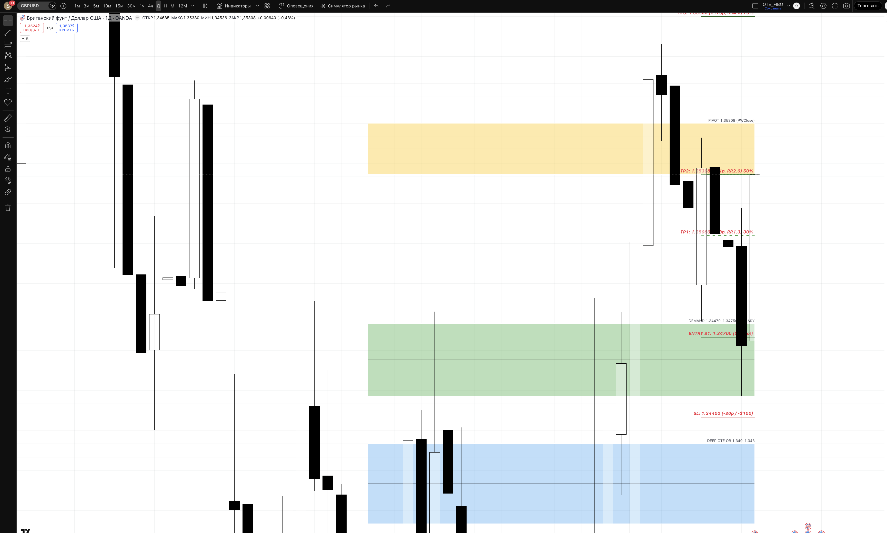
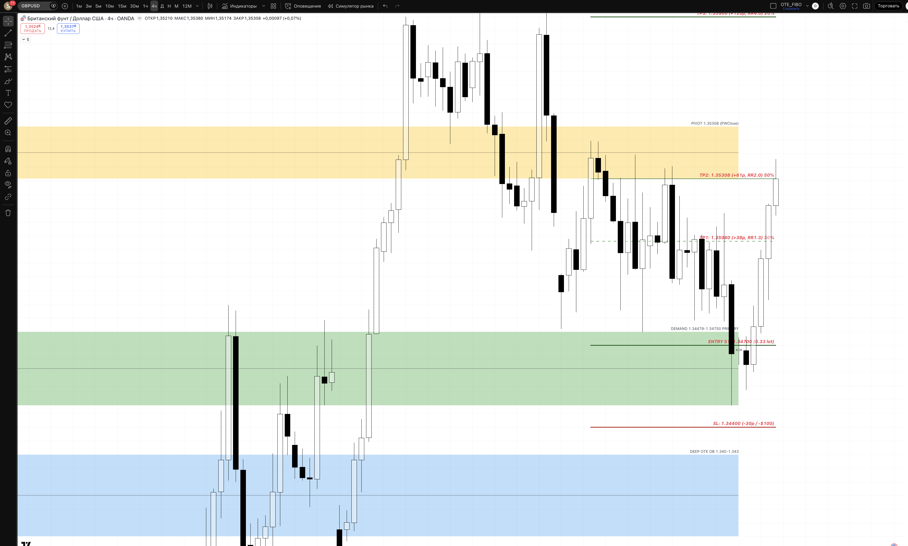
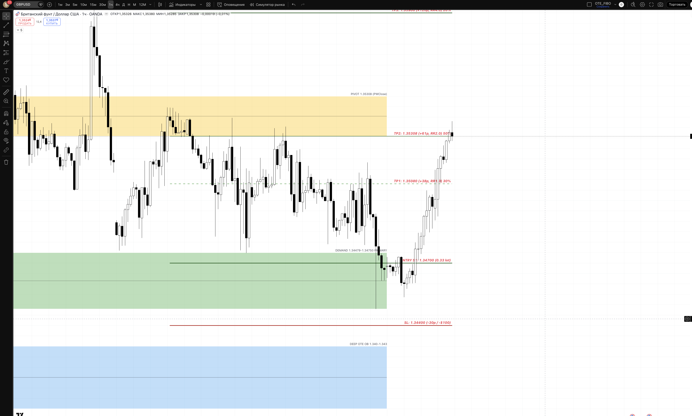
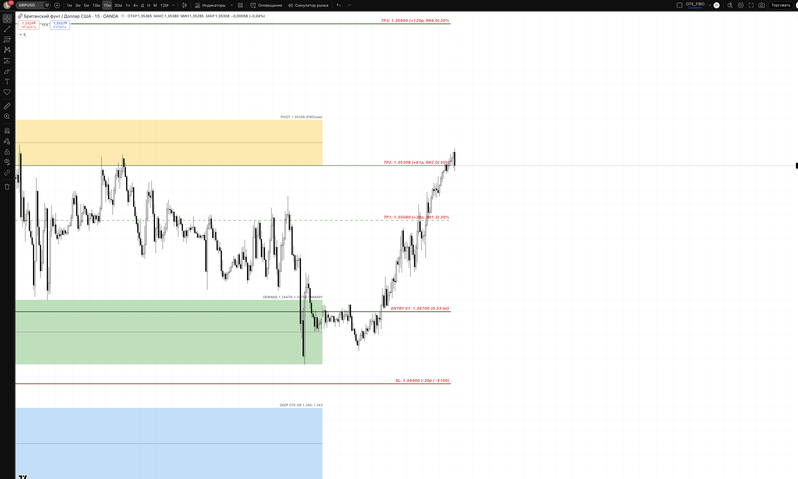

## 🎯 Пара: GBPUSD | Період: 27 квіт – 1 трав 2026
**Поточна ціна (Fri close):** 1.35308
**Стиль:** ⚡ ТІЛЬКИ ДЕННА ТОРГІВЛЯ (intraday — закриття до кінця сесії)

---

## 📖 Читання ринку — що відбулось і куди рухаємось

### Звідки прийшли (контекст)

Починаючи з 29 березня, фунт зробив один з найсильніших рухів кварталу: з 1.31596 до 1.35996 до 10 квітня — це +440 pips за ~9 торгових днів. Рушійна сила — масштабна слабкість долара на фоні тарифної невизначеності та зниження очікувань щодо Fed. Фунт виглядав сильніше за євро, ведучи практично вертикально.

На рівні 1.35996 ринок дістався до зони накопиченої ліквідності зверху (BSL — Buy Side Liquidity): тут розміщені стопи продавців з попередніх тижнів і ордери інституцій. Покупці зафіксували прибуток, продавці відкрили позиції — почалась корекція.

### Що відбулось минулого тижня

Корекція тривала чотири дні поспіль, кожен день нижче попереднього:

> 1.35446 → 1.34908 → 1.34750 → 1.34479 (інтрадей мінімум)

Логіка цього руху: після такого різкого bullish імпульсу ринку потрібна "перезарядка". Смарт-мані фіксують частину лонгів, створюючи тиск продажів, і одночасно готуються до нового набору позицій — але вже на нижчих рівнях, у зоні попиту.

**П'ятниця — ключова подія тижня.** Ціна пробила нижче 1.34479 (попередній тижневий мінімум, SSL), дотягнувшись до інтрадей low. Це sweep: ринок навмисно забрав стопи тих, хто тримав лонги від нижніх рівнів, і одночасно затягнув у шорти тих, хто чекав "пробою підтримки". Після зняття ліквідності — різкий розворот вгору. Закриття дня: **1.35308** — практично повний відкат назад вище зони demand.

Денна свічка — класичний bullish hammer з довгим нижнім тінем після sweep. Сигнал поглинання.

### Де знаходимось зараз і чому це важливо

Ціна закрила тиждень рівно на 1.35308 — це одночасно PWClose (закриття попереднього тижня) і зараз стає поточним pivot. Місце закриття символічне: ринок повністю відновив тижневі втрати у п'ятницю одним сильним bullish рухом.

Структура підтверджує bullish bias:
- **BOS UP на Daily** підтверджений вище 1.35664 — структура вища від попередньої
- **HH/HL (вищий хай, вищий лоу)** на тижневому таймфреймі збережена
- Demand zone 1.34479–1.34750 витримала — ринок відштовхнувся і закрився вище

### Куди рухаємось далі

**Основний сценарій (60%):** фунт продовжує bullish рух до 1.35900–1.35996 (PWH/BSL) — рівня де накопичена ліквідність зверху. Це логічна ціль: ринок зняв SSL знизу (п'ятниця), тепер йде за BSL зверху. Між поточною ціною та ціллю лежить 1.35080 (intraday resistance, TP1) і сама ціль 1.35900–1.35996.

**Що підтримує цей погляд:** фунт стабільно сильний проти долара; DXY залишається слабким; BoE не планує різких змін; технічна структура bullish. Sweep + hammer на D — один із найнадійніших сигналів розвороту в SMC-підході.

**Умова для реалізації:** понеділок відкривається без різкого гепу вниз. London KZ або дає новий sweep demand для входу (Setup 1), або ціна вже вище 1.35400 і ми шукаємо continuation (Setup 2).

**Що може зламати план:** якщо H4 закриється нижче 1.34479 — demand zone "не витримала", і ймовірний подальший спуск до 1.34000 (deep OTE) або 1.33700 (invalidation). В такому разі — стоїмо осторонь, bias переглядаємо.

---

## 📊 Скріншоти з зонами підтримки/опору

### 🟦 Daily — HTF структура + зони

**Що бачимо на чарті:**
Повний bullish leg 1.31596 → 1.35996 і чотириденна корекція в demand zone. П'ятнична свічка — bullish hammer після sweep 1.34479. Поточна ціна (1.35308) знаходиться між demand та PWH — ринок "заряджений" на рух вгору.

- 🔴 RESISTANCE 1.35996 — PWH, BSL. Хай попереднього тижня. Саме тут ринок зупинився і розвернувся вниз тиждень тому. Тепер — фінальна ціль bullish руху. Очікуємо реакцію при наближенні.
- 🟡 PIVOT 1.35308 — PWClose, поточне закриття тижня. Ціна закрилась рівно тут — ключовий рівень прийняття рішення ринком. Пробій вверх → відкривається шлях до 1.35900.
- 🟢 DEMAND 1.34479–1.34750 — зона де sweep стався і ринок закрився значно вище. Тут відбулось поглинання: інституції купили у тих, хто продавав "пробій". PRIMARY зона для лонгів при поверненні.
- 🔵 DEEP OTE 1.34000–1.34300 — глибший bullish OB на Daily. Агресивний лонг лише якщо demand zone не витримає першої атаки.
- 🔴 INVALIDATION 1.33700 — нижче цього рівня HTF структура зламана. Лонги скасовуємо повністю.

### 🟦 H4 — entry context

**Що бачимо на чарті:**
	На H4 детально видна механіка корекції: серія низхідних H4 барів привела ціну до demand zone, де остання свічка тижня стала різко bullish — велике тіло, закриття у верхній частині. Це H4 bullish engulfing прямо в зоні попиту — додаткове підтвердження що покупці захопили контроль. Обсяги на розвороті помітно зростали.

### 🟢 H1 — Intraday entries

**Що бачимо на чарті:**
H1 показує точну механіку п'ятничного sweep: різкий шпиль вниз під 1.34479 з миттєвим поверненням — класичний "wick rejection" у demand zone. Після цього — п'ять бичих H1 свічок підряд без серйозних корекцій. ChoCH підтверджений на H1.

Рівні для Setup 1 нанесені:
- 🟢 ENTRY 1.34700 — у зоні demand після sweep
- 🔴 SL 1.34400 — під зоною з буфером
- 🟢 TP1 1.35080 — intraday resistance, перший бар'єр
- 🟢 TP2 1.35308 — pivot рівень, головна ціль
- 🟢 TP3 1.35900 — PWH кластер, runner ціль

### ⚡ M15 — Trigger TF

**Що бачимо на чарті:**
M15 показує sweep під 1.34479 з наступним BOS вверх — ідеальний приклад Setup 1. Видно: спочатку агресивна M15 свічка вниз (sweep), потім ChoCH на M15 — свічка що закривається вище попереднього структурного хаю. Саме такий патерн є trigger для входу в понеділок: чекаємо sweep → BOS → entry на ретесті.

---

## 🎯 Ключові рівні тижня

| Рівень | Ціна | Що це і чому важливо |
|--------|------|----------------------|
| 🔴 PWH / BSL | 1.35996 | Хай попереднього тижня. Накопичені стопи продавців — ціль для зняття ліквідності зверху |
| 🔴 Resistance cluster | 1.35900 | Кластер swing-хаїв. Очікуємо реакцію продавців |
| 🟡 PWClose pivot | **1.35308** | Поточний pivot. Пробій вверх відкриває шлях до 1.359 |
| TP1 area | 1.35080 | Intraday resistance, перша зупинка бичого руху |
| 🟢 DEMAND zone | **1.34479–1.34750** | Sweep + відскок п'ятниці. PRIMARY зона для лонгів |
| 🔵 Deep OTE | 1.34000–1.34300 | Глибший D bullish OB, агресивний лонг |
| 🔴 Invalidation | 1.33700 | HTF структура зламана, bias міняється |

---

## 💡 Тижневі сценарії

### Сценарій A — Bullish reversal через sweep (~60%) — ОСНОВНИЙ
Ринок робить інтрадей дип під 1.34479 на початку тижня → sweep SSL → BOS вверх на M5/M15 → Setup 1 long. Ціль тижня: 1.35900–1.35996. Цей сценарій підтримується: sweep + hammer на D, BOS вверх на Daily, слабкий DXY, збережена HH/HL структура.

### Сценарій B — Continuation higher без sweep (~25%)
Ціна відкривається сильно і вже в понеділок пробиває 1.35400 без повернення до demand. BOS вверх на H1 підтверджений → шукаємо pullback на 1.35100–1.35200 для входу (Setup 2). Менший потенціал по пунктах, але ринок показує силу.

### Сценарій C — Bearish breakdown (~15%) — INVALIDATION
H4 закривається нижче 1.34479 → demand zone не витримала. Переходимо до нейтрального bias. Шорти — тільки на ретест 1.34750 з BOS вниз на M15. Лонги не відкриваємо.

---

## ⚡ INTRADAY TRADE PLAN — ПОНЕДІЛОК (28 квіт)

### 🟢 SETUP 1 (PRIORITY) — Long після sweep
**Сесія:** London KZ 10:00–12:00 EET

**Логіка:** Повторення п'ятничного сценарію. Asian сесія може створити pressure вниз до demand zone — sweep SSL, потім London підхоплює і дає BOS вверх. Входимо на ретесті зони після підтвердження.

| Параметр | Значення |
|----------|---------|
| **Trigger** | Sweep < 1.34479 + bullish ChoCH/BOS на 5m |
| **Entry** | 1.34700 (ретест demand zone) |
| **SL** | 1.34400 (-30 pips / -$100) |
| **TP1 (30%)** | 1.35080 (+38p / +$125) RR 1:1.3 → BE |
| **TP2 (50%)** | 1.35308 (+61p / +$201) RR 1:2.0 |
| **TP3 (20%)** | 1.35900 (+120p / +$396) RR 1:4.0 |
| **Lot** | **0.33** |
| **Close by** | NY close 22:00 EET (без переносу) |

### 🔵 SETUP 2 (FALLBACK) — Continuation long
**Активується якщо:** ціна > 1.35400 + BOS UP на 15m > 1.35446

**Логіка:** Ринок занадто сильний для повернення до demand — шукаємо pullback на H1 demand для входу перед наступним push до 1.35900.

| Параметр | Значення |
|----------|---------|
| **Entry** | 1.35100–1.35200 (H1 demand pullback) |
| **SL** | 1.34900 (-25 pips) |
| **TP1** | 1.35446 (+30p) RR 1:1.2 |
| **TP2** | 1.35900 (+75p) RR 1:3.0 |
| **Lot** | 0.40 |

---

## ⏱ Тайминг сесій (intraday only)

| Сесія | UTC | EET | Дія |
|-------|-----|-----|-----|
| Asian range mark | до 07:00 | до 10:00 | 📋 mark only |
| **London KZ** | 07:00–09:00 | 10:00–12:00 | 🎯 PRIMARY entry |
| London | 09:00–12:00 | 12:00–15:00 | менеджмент |
| **NY KZ** | 12:00–14:00 | 15:00–17:00 | 🎯 SECONDARY entry |
| NY | 14:00–17:00 | 17:00–20:00 | менеджмент / TP3 |
| ❌ Late NY | > 17:00 | > 20:00 | no new entries |
| 🚫 Force close | 21:00 | 00:00 (Tue) | exit all positions |

---

## 🚨 Risk management

- 1% / угоду = $100
- Daily DD limit: 3% = $300 → stop after 2 losses
- Max 2 одночасні позиції на парі
- ❌ NO HOLD overnight
- News check: BoE / Fed releases — пропускаємо 30 хв до/після

## ⚠️ Plan invalidation

| Подія | Дія |
|-------|-----|
| D close < 1.33700 | Скасувати longs, перейти до Сценарію C |
| H4 close > 1.35900 до open | Setup 1 → пропустити, Setup 2 only |
| GBPUSD vs EURUSD divergence | Перевірити DXY перед входом |

---

## 🔗 Пов'язані
- [[20-Trading/Analysis/2026-W18-Apr27-May01/EURUSD/analysis]]
- [[20-Trading/TradingView-MCP-Guide]]

## 📎 Артефакти
- TV layout: 1uLQZkqh
- Скріншоти: ця папка
