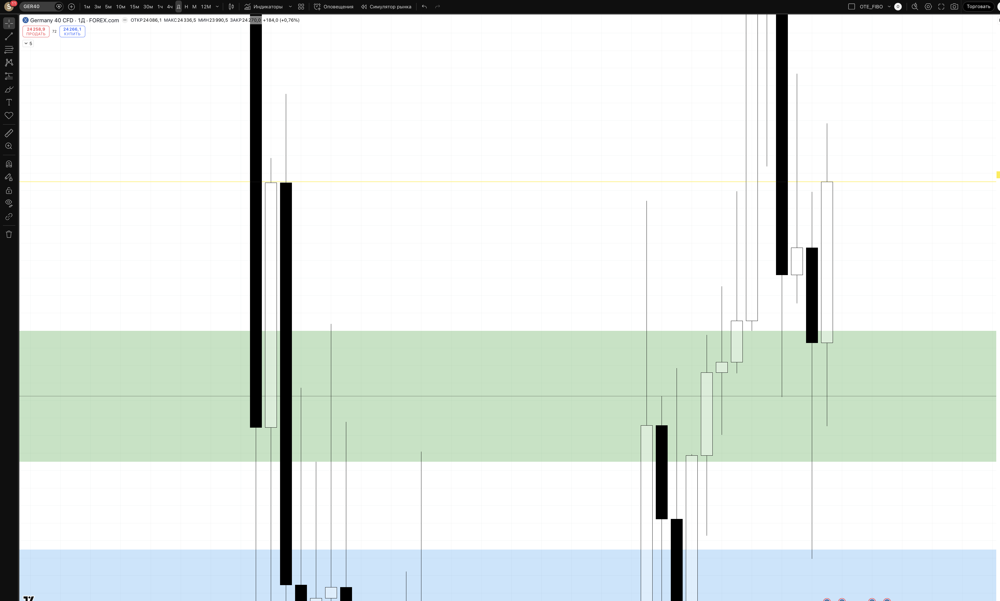
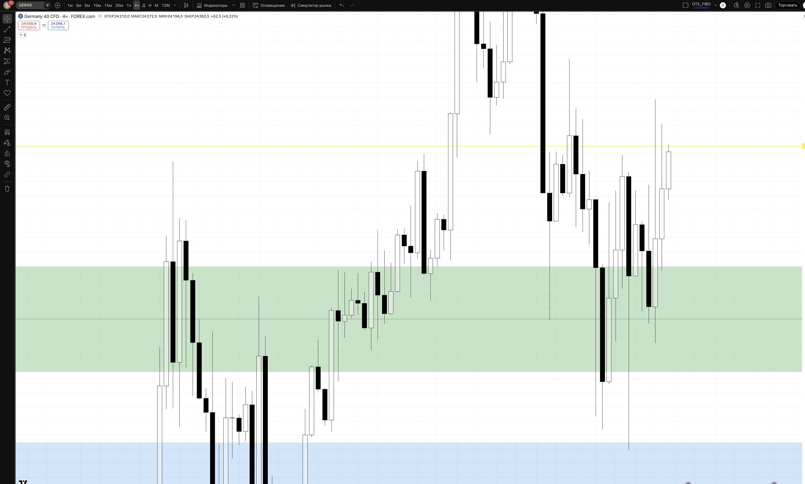
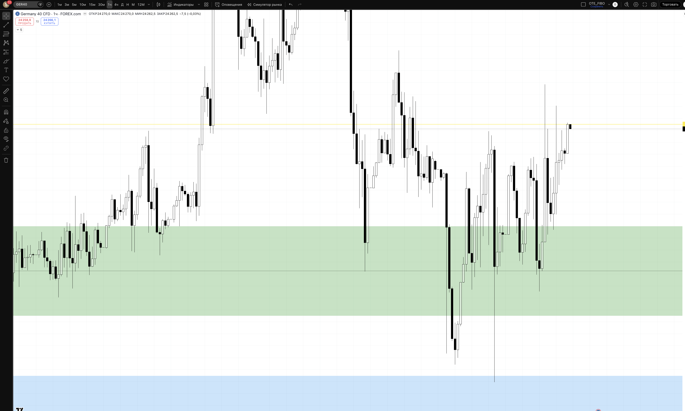
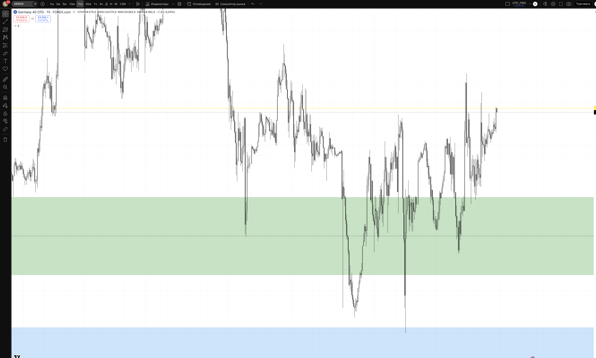

## 🎯 Пара: GER40 (DAX 40) | Період: 27 квіт – 1 трав 2026
**Поточна ціна (Fri close):** 24270
**Стиль:** ⚡ ТІЛЬКИ ДЕННА ТОРГІВЛЯ (intraday — закриття до кінця сесії)

---

## 📖 Читання ринку — що відбулось і куди рухаємось

### Звідки прийшли (контекст)

GER40 (DAX 40) — провідний індекс Німеччини та фактично індикатор стану всієї Єврозони. Цей квартал виявився надзвичайно волатильним: на початку квітня індекс торгувався в зоні 21934–22431 (31 березня), після чого стрімко злетів угору разом з відновленням ризик-апетиту на ринках.

Рушійні сили bullish руху: зниження ризиків торговельної війни (перші сигнали про можливе перемир'я в тарифному конфлікті), слабкість USD що підняла EUR і позитивно вплинула на євро-активи, а також покращення очікувань щодо стану економіки Єврозони. Коли EURUSD зростає — GER40 зазвичай корелює позитивно, оскільки іноземні інвестори отримують кращу прибутковість при конвертації в EUR.

З 31 березня (low 21934) до 18 квітня (ATH 24798) індекс виріс на **+2864 пунктів (+13%)** за три тижні. Особливо виразний стрибок стався 9 квітня (+750 пунктів в один день: з 23238 до 23991) і 18 квітня (закриття 24640, high 24798).

### Що відбулось минулого тижня

Тиждень W17 (21–25 квітня) показав перше "охолодження" після агресивного зростання:

> Пн 24498 → Вт 24163 → Ср 24194 → Чт 24086 → Пт 24270

Структура тижня:
- **Понеділок** відкрився на 24640 (gap down з п'ятничного закриття), high дорівнював open — продавці відразу тиснули
- **Вівторок** — найслабший день: high лише 24611, close 24163 (падіння -335 пунктів)
- **Середа-четвер** — консолідація з продовженням зниження до тижневого мінімуму **23839** (четвер)
- **П'ятниця** — відновлення: з 24086 до 24270, high 24336 — ринок підтвердив що 23839 є важливою підтримкою

Загальна корекція від ATH 24798 до low 23839 = **-959 пунктів (-3.9%)** — помірна корекція в здоровому bullish тренді. Indice залишається значно вище старих рівнів (21934 = місяць тому).

### Де знаходимось зараз

Ціна закрила тиждень на 24270 — між двома ключовими зонами:
- Зверху: **RESISTANCE 24600–24800** — ATH/BSL зона. Звідси тиждень розпочав корекцію
- Знизу: **SUPPORT 23950–24100** — зона множинних торкань (14–17 квітня консолідація)

П'ятнична свічка — bullish, з закриттям вище середини тижневого рейнджу. Це ознака що ведмежий тиск послаблюється і покупці повертаються.

### HTF Bias: 🟢 BULLISH (з корекційною паузою)

Bullish структура збережена: нові HH (24798 > попередні хаї), HL (23839 > попередніх структурних лоу). EUR сильний, DXY слабкий, ризик-апетит відновлюється. Корекція — нормальна після +13% за 3 тижні.

### Куди рухаємось далі

**Основний сценарій (65%) — Bullish continuation:** після корекції до support 23950–24100 ринок відновлюється і тестує resistance 24600–24800 (ATH sweep). Підтримується: bullish structure, EURUSD bullish кореляція, відновлення ризик-апетиту.

**Альтернатива (25%) — Consolidation рейндж:** індекс консолідується між 23850 та 24600. Торгуємо краї: long від support, short від resistance.

**Ведмежий сценарій (10%) — Breakdown:** пробій 23650 → demand zone 23650–23850 не витримала → шлях до 23200–23400. Стоїмо осторонь лонгів.

---

## 📊 Скріншоти з зонами підтримки/опору

### 🟦 Daily — HTF структура + зони

**Що бачимо на чарті:**
Масштабне bullish зростання з 21934 до ATH 24798 за три тижні. Тиждень корекції — перший "down week" — але структура збережена. П'ятнична свічка — відновлення від тижневого мінімуму 23839.

- 🔴 RESISTANCE 24600–24800 — ATH / BSL. Тижневий хай + абсолютний максимум. Очікуємо реакцію при наближенні.
- 🟡 PIVOT 24270 — Fri close. Нейтральна зона між support та resistance.
- 🟢 SUPPORT 23950–24100 — Зона множинних денних закрить (14–17 квіт). Multi-touch = сильна підтримка. PRIMARY зона для LONG.
- 🔵 DEMAND 23650–23850 — Тижневий low (23839) + D bullish OB. LONG при глибшому заході + підтвердження.
- 🔴 INVALIDATION 22800 — Bullish bias скасовано. Нижче — переглядаємо bias.

### 🟦 H4 — entry context

**Що бачимо на чарті:**
H4 показує тижневу корекцію детально: серія bearish H4 барів від 24640 до 23839. Потім — bullish відновлення у п'ятницю. Зони support (зелена) та demand (синя) добре видно.

### 🟢 H1 — Intraday entries

**Що бачимо на чарті:**
H1 показує структуру тижня: LL/LH вниз (Пн-Чт) → ChoCH вгору у п'ятницю від demand. Саме на H1 підтверджуємо розворот перед входом. При поверненні до support 23950–24100 → чекаємо H1 BOS вгору як підтвердження.

### ⚡ M15 — Trigger TF

**Призначення:**
- **LONG trigger:** Ціна в 23950–24100 + SSL sweep + M15 BOS вгору → long з цілями до 24500+
- **SHORT trigger (контр-тренд):** Ціна в 24600–24800 + BSL sweep + M15 BOS вниз → short (обережно — проти тренду)

---

## 🎯 Ключові рівні тижня

| Рівень | Ціна | Що це і чому важливо |
|--------|------|----------------------|
| 🔴 ATH / BSL | 24798 | Абсолютний максимум. Ціль для BSL sweep |
| 🔴 Resistance | **24600–24800** | Тижневий high + ATH. Очікуємо реакцію |
| 🟡 PIVOT | **24270** | Fri close. Нейтральна зона |
| 🟢 Support | **23950–24100** | Multi-touch підтримка. PRIMARY LONG зона |
| 🔵 Demand | **23650–23850** | Тижневий low. Агресивний LONG з підтвердженням |
| 🔴 Invalidation | 22800 | Bullish bias скасовано |

---

## 💡 Тижневі сценарії

### Сценарій A — LONG з support (~65%) — ОСНОВНИЙ
Понеділок коригується до 23950–24100 → SSL sweep → M15 BOS вгору → long. Ціль: 24270 → 24500 → 24600+. Підтримується: bullish tренд, multi-touch support, EURUSD bullish, відновлення ризик-апетиту.

### Сценарій B — Consolidation 23850–24600 (~25%)
Торгуємо краї рейнджу. Long від 23950 з SL під 23839, short від 24600+ (обережно). RR обмежений.

### Сценарій C — Breakdown (~10%)
Пробій 23650 + H4 close нижче → стоїмо осторонь лонгів. Short на ретест 23850 з BOS вниз на M15.

---

## ⚡ INTRADAY TRADE PLAN — ПОНЕДІЛОК (28 квіт)

### 🟢 SETUP 1 (PRIORITY) — LONG з support
**Сесія:** Frankfurt open / London KZ 10:00–12:00 EET

**Логіка:** Типова "buy the dip" стратегія в bullish тренді. Індекс коригується до multi-touch support 23950–24100, де накопичуються покупці перед наступним push до ATH.

| Параметр | Значення |
|----------|---------|
| **Trigger** | Ціна в 23950–24100 + SSL sweep + M15 BOS вгору |
| **Entry** | 24000–24050 (ретест support зверху) |
| **SL** | 23700 (-300 pts / ~-$100) |
| **TP1 (30%)** | 24270 (+230 pts) → BE |
| **TP2 (50%)** | 24500 (+460 pts) RR 1:1.5 |
| **TP3 (20%)** | 24700 (+680 pts) RR 1:2.3 |
| **Lot** | **~0.30** |
| **Close by** | 22:00 EET (Frankfurt close) |

> Pip value GER40: ~$1 per point per lot (1 лот = €1/pt × EUR/USD 1.17 ≈ $1.17/pt). Lot ≈ $100 / (300 × $1.17) ≈ 0.28–0.30. Перевір у свого брокера точний контракт.

### 🔵 SETUP 2 (FALLBACK) — LONG continuation вище pivot
**Активується якщо:** ціна тримається над 24270 + BOS вгору на H1 вище 24400

| Параметр | Значення |
|----------|---------|
| **Entry** | 24280–24320 (H1 pullback до PIVOT) |
| **SL** | 23980 (-320 pts) |
| **TP1** | 24500 (+200 pts) → BE |
| **TP2** | 24700 (+400 pts) RR 1:1.25 |
| **Lot** | 0.28 |

---

## ⏱ Тайминг сесій (intraday only)

| Сесія | UTC | EET | Дія |
|-------|-----|-----|-----|
| Pre-market | до 07:00 | до 10:00 | 📋 mark only |
| **Frankfurt open** | 07:00–09:00 | 10:00–12:00 | 🎯 PRIMARY entry |
| London | 09:00–12:00 | 12:00–15:00 | менеджмент |
| **NY open** | 13:30–15:30 | 16:30–18:30 | 🎯 SECONDARY entry |
| NY | 15:30–17:00 | 18:30–20:00 | менеджмент / TP |
| ❌ Late session | > 17:00 | > 20:00 | no new entries |
| 🚫 Force close | 21:00 | 00:00 (Tue) | exit all |

> 📌 GER40 дуже чутливий до: German/EU macro data (CPI, GDP, PMI), ECB speakers, US market open (NY gap). Перевіряти EU economic calendar.

---

## 🚨 Risk management

- 1% / угоду = $100
- Daily DD limit: 3% = $300
- ❌ NO HOLD overnight (індекс може гепнути на news overnight)
- News check: German IFO, EU PMI, ECB speakers, US data
- Lot розрахунок: залежить від брокера — перевір розмір контракту GER40 перед входом

## ⚠️ Plan invalidation

| Подія | Дія |
|-------|-----|
| H4 close < 23650 | Demand пробита. Bullish bias під питанням. Стоїмо осторонь |
| H4 close > 24700 | Resistance пробита. Long continuation без setup 1 |
| ECB hawkish statement | EUR spike вгору → GER40 може реагувати негативно |
| EURUSD різко падає | GER40 correlation перевірити |

---

## 🔗 Пов'язані
- [[20-Trading/Analysis/2026-W18-Apr27-May01/EURUSD/analysis]]
- [[20-Trading/TradingView-MCP-Guide]]

## 📎 Артефакти
- TV layout: 1uLQZkqh
- Скріншоти: ця папка
