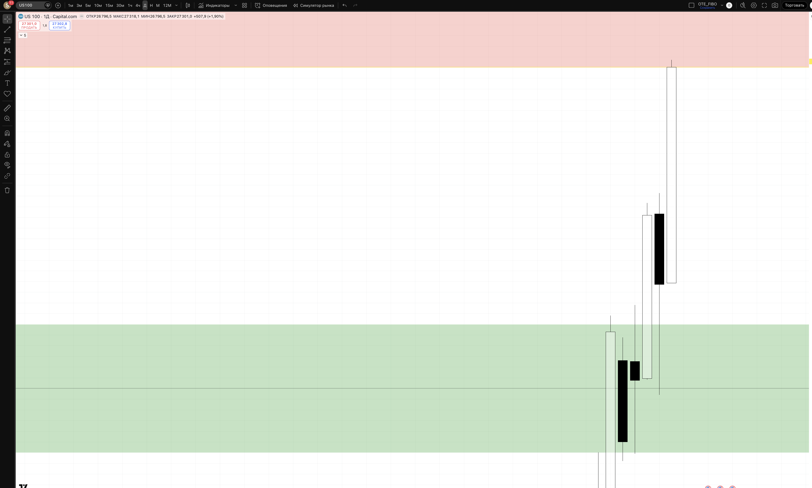
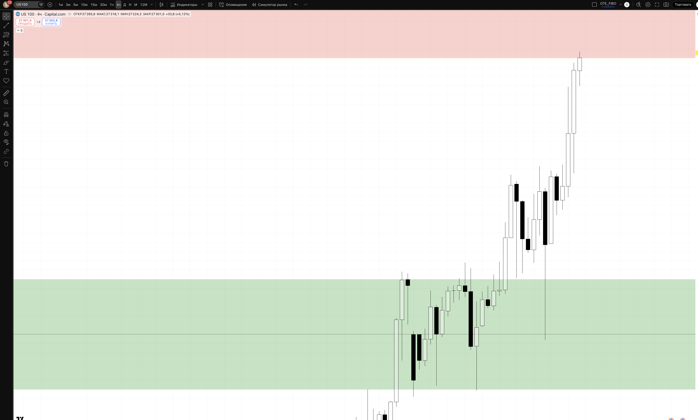
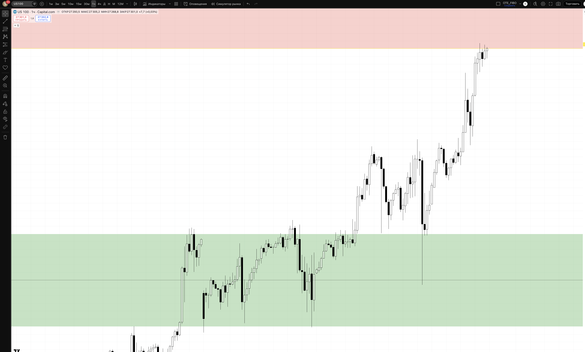
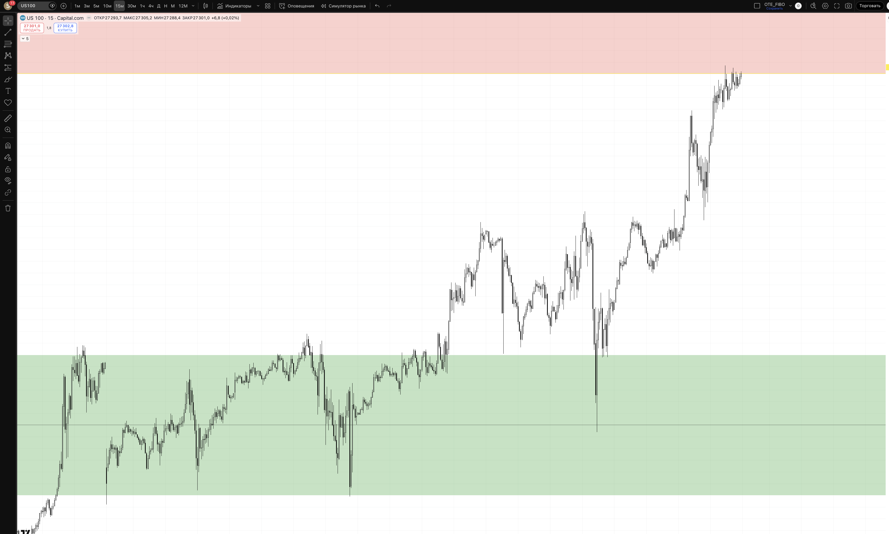

## 🎯 Пара: US100 (Nasdaq 100) | Період: 27 квіт – 1 трав 2026
**Поточна ціна (Fri close):** 27301
**Стиль:** ⚡ ТІЛЬКИ ДЕННА ТОРГІВЛЯ (intraday — закриття до кінця сесії)

---

## 📖 Читання ринку — що відбулось і куди рухаємось

### Звідки прийшли (контекст)

US100 (Nasdaq 100) — найбільш технологічно-орієнтований індекс США. Він дуже чутливий до: змін ставки Fed (growth stocks = rate sensitive), корпоративних earnings великих tech компаній (Apple, Microsoft, Nvidia, Meta, Alphabet) та загальних ринкових sentiment-змін.

У квітні 2026 US100 пережив одну з найбільших "V-recovery" за останні місяці: на тлі тарифної кризи ранньо-квітневий мінімум склав ~22779 (1 квітня), після чого розпочалось агресивне відновлення. 9 квітня індекс підстрибнув з 24200 до 24864 в один день (+664 пункти) — ймовірно після позитивних новин щодо зменшення тарифного тиску або сильних корпоративних earnings.

З 1 квітня (low 22779) до 25 квітня (high 27318) = **+4539 пунктів (+19.9%) за 17 торгових днів**. Це один із найшвидших recoveries в техіндексі за останні роки.

### Що відбулось минулого тижня

Тиждень W18 (21–25 квітня) — **перший тиждень де US100 ЗРОСТАВ**, на відміну від більшості інших активів у watchlist, які коригувались:

> Пн 26615 → Вт 26568 → Ср 26955 → Чт 26793 → Пт 27301

Структура тижня:
- **Понеділок-вівторок** — консолідація в зоні 26397–26744 (narrow range, ринок "дихав")
- **Середа** — bullish breakout: з 26570 до 26955 (+385 пунктів)
- **Четвер** — незначний pullback до 26534 (low), відновлення до 26793
- **П'ятниця** — сильний bullish push: з 26796 до 27318 (high), закриття 27301

П'ятниця стала ключовою: індекс пробив вище попереднього тижневого хаю (26720) і закрився на нових кількатижневих максимумах. Це класичний **BSL sweep + continuation** — ринок забрав стопи продавців вище 26720 і продовжив рух вгору.

### Де знаходимось зараз

Ціна закрила тиждень на 27301 — біля кількатижневого максимуму 27318. US100 знаходиться в **зовсім іншій ситуації** ніж інші пари у watchlist:
- Немає корекції від хаїв — тиждень закрився NА ВЕРШИНІ
- Bullish momentum збережений: кожен тиждень — нові HH
- Найближча підтримка: 26400–26700 (W18 intraweek lows = 3-4 дні консолідації)

Це означає що для intraday торгівлі W18 ситуація інша: **ми не чекаємо short від resistance — ми чекаємо pullback для long входу**.

### HTF Bias: 🟢 BULLISH (strong momentum)

Nasdaq є лідером ринкового відновлення. Tech earnings (Meta, Alphabet, Microsoft — зазвичай звітують в кінці квітня) можуть бути каталізатором наступного руху. Якщо earnings сильні → US100 прискорюється до нових ATH. Якщо earnings розчаровують → корекція до support.

### Куди рухаємось далі

**Основний сценарій (65%) — LONG continuation після pullback:** понеділок може показати корекцію від кількатижневих хаїв. Якщо ціна повертається до 26400–26700 → BOS вгору на H1 → long continuation до 27500+ (психологічний рівень) та вище.

**Альтернатива (25%) — Продовження без корекції:** ринок настільки strong що понеділок відкривається вище 27300 і відразу йде до 27600+. Setup 2 — continuation long на мінімальному pullback.

**Ведмежий сценарій (10%) — Earnings disappointment:** якщо великі tech розчарують → gap down в понеділок-вівторок. Тільки якщо H4 закривається нижче 26000 → переглядаємо bias.

---

## 📊 Скріншоти з зонами підтримки/опору

### 🟦 Daily — HTF структура + зони

**Що бачимо на чарті:**
Масштабне V-відновлення з ~22779 до 27318 за 17 днів. Bullish momentum очевидний — кожен тиждень нові максимуми. Поточна ціна (27301) — біля тижневого хаю. Support (зелена) добре видна нижче.

- 🔴 BSL ZONE 27300–27600 — Поточний рівень + психологічний round number 27500. При консолідації тут → може бути пауза перед наступним кроком.
- 🟡 PIVOT 27301 — Fri close = PWH. Ринок закрився прямо на хаю тижня — bullish сигнал.
- 🟢 SUPPORT 26400–26700 — Зона W18 intraweek lows (Пн-Вт консолідація). Тут покупці активно набирали позиції. PRIMARY LONG зона при поверненні.
- 🔵 DEMAND 25750–26000 — W17 base / D bullish OB. Більш глибока підтримка. LONG при сильнішому pullback.
- 🔴 INVALIDATION 24200 — Bullish bias скасовано нижче W15 highs.

### 🟦 H4 — entry context

**Що бачимо на чарті:**
H4 показує тижневу структуру детально: 2 дні консолідації (Пн-Вт у 26400–26700) → bullish breakout Ср → невеликий pullback Чт → новий high П'ят. ChoCH і BOS вгору добре видні. Support zone внизу (зелена) — де ринок "заправлявся" перед bullish push.

### 🟢 H1 — Intraday entries

**Що бачимо на чарті:**
H1 показує bullish momentum тижня: серія higher highs / higher lows. П'ятничний push — сильний bullish H1 рух від 26796 до 27318. Для LONG входу в понеділок — чекаємо pullback до H1 demand (26900–27000 area) або до support zone 26400–26700.

### ⚡ M15 — Trigger TF

**Призначення:**
- **LONG trigger (pullback):** Ціна в 26400–26700 + SSL sweep + M15 BOS вгору → long
- **LONG trigger (continuation):** Ціна консолідується 26900–27100 + M15 BOS вище 27100 → long до 27500

---

## 🎯 Ключові рівні тижня

| Рівень | Ціна | Що це і чому важливо |
|--------|------|----------------------|
| 🎯 Psychological | 27500 | Круглий рівень. Ціль bullish руху |
| 🔴 BSL Zone | **27300–27600** | Поточна ціна + потенційна BSL sweep зона |
| 🟡 PIVOT | **27301** | Fri close = PWH. Bullish close |
| 🟢 Support | **26400–26700** | W18 intraweek lows. PRIMARY LONG зона при дипі |
| 🔵 Demand | **25750–26000** | W17 base / D OB. Глибша підтримка |
| 🔴 Invalidation | 24200 | Bullish bias скасовано |

---

## 💡 Тижневі сценарії

### Сценарій A — LONG з pullback до support (~65%) — ОСНОВНИЙ
Понеділок відкривається з gap або корекцією до 26400–26700. SSL sweep → H1 BOS вгору → long. Ціль: 27301 → 27500 → 27700. Підтримується: strong bullish momentum, новий тижневий high, tech earnings season (позитивний очікуваний ефект).

### Сценарій B — Continuation long без deep pullback (~25%)
Ринок тримається вище 27000 і невдовзі breakout вище 27318. Шукаємо мінімальний pullback до 26900–27050 на M15 BOS вгору → long. Менший потенціал по пунктах, але сильна momentum торгівля.

### Сценарій C — Earnings gap down (~10%)
Несподівано слабкі tech earnings → gap down. Якщо H4 close < 26000 → стоїмо осторонь. Розглядаємо short ТІЛЬКИ при H4 close < 25750 з BOS вниз.

---

## ⚡ INTRADAY TRADE PLAN — ПОНЕДІЛОК (28 квіт)

### 🟢 SETUP 1 (PRIORITY) — LONG з pullback до support
**Сесія:** NY KZ 15:00–17:00 EET (US100 активний переважно у NY сесію)

**Логіка:** Після тижня strong bullish руху ринок може показати ранню корекцію на Asian/London. NY відкриття (16:30 EET) — головний каталізатор для US100. Якщо Asian/London тягне до support → NY дає BOS вгору → long continuation.

| Параметр | Значення |
|----------|---------|
| **Trigger** | Ціна в 26400–26700 + SSL sweep + M15 BOS вгору |
| **Entry** | 26550–26650 (ретест support зверху) |
| **SL** | 26200 (-350 pts / ~-$100) |
| **TP1 (30%)** | 27000 (+400 pts) → BE |
| **TP2 (50%)** | 27301 (+700 pts) RR 1:2.0 |
| **TP3 (20%)** | 27600 (+1000 pts) RR 1:2.8 |
| **Lot** | **~0.07** |
| **Close by** | NY close 22:00 EET |

> Pip value US100: ~$1 per point per 0.01 lot (Capital.com/broker dependent). Lot ≈ $100 / (350 × $1 / 0.01 × 0.01) = 0.07... Перевір у свого брокера точний розмір контракту.

### 🔵 SETUP 2 (FALLBACK) — Continuation long від near-pivot
**Активується якщо:** ціна тримається над 27000 + консолідація + M15 BOS вище 27320

| Параметр | Значення |
|----------|---------|
| **Entry** | 27050–27150 (M15 pullback) |
| **SL** | 26800 (-300 pts) |
| **TP1** | 27400 (+280 pts) → BE |
| **TP2** | 27700 (+580 pts) RR 1:1.9 |
| **Lot** | 0.07 |

---

## ⏱ Тайминг сесій (intraday only)

| Сесія | UTC | EET | Дія |
|-------|-----|-----|-----|
| Pre-market | до 13:30 | до 16:30 | 📋 mark only (US futures!) |
| **NY pre-market** | 13:00–13:30 | 16:00–16:30 | 🎯 Setup моніторинг |
| **NY open** | 13:30–15:30 | 16:30–18:30 | 🎯 PRIMARY entry |
| NY | 15:30–17:00 | 18:30–20:00 | менеджмент / TP |
| ❌ Late NY | > 17:00 | > 20:00 | no new entries |
| 🚫 Force close | 21:00 | 00:00 (Tue) | exit all |

> 📌 US100 найбільш активний у NY сесію (16:30–22:00 EET). London KZ дає менш надійні сигнали для Nasdaq. Earnings announcements — часто after-market (після 22:00 EET) або pre-market — ефект видно на наступний день.

---

## 🚨 Risk management

- 1% / угоду = $100
- Daily DD limit: 3% = $300
- ❌ NO HOLD overnight (earnings gap ризик!)
- News check: Big tech earnings (Meta Tue Apr 29, Microsoft Wed Apr 30, Apple Thu May 1), Fed speakers, US GDP (Wed Apr 30)
- **⚠️ EARNINGS WEEK:** Meta, Microsoft, Apple звітують W18! Expect HIGH volatility. Зменшити lot або пропустити якщо earnings в той самий день.

## ⚠️ Plan invalidation

| Подія | Дія |
|-------|-----|
| Tech earnings miss (Meta/MSFT/AAPL) | Gap down можливий. Не входити до прояснення |
| H4 close < 26000 | Demand пробита. Bullish bias під загрозою |
| H4 close > 27500 | Continuation strong. Long setup 2 активний |
| Fed hawkish surprise | Risk-off → US100 може різко впасти |

---

## 🔗 Пов'язані
- [[20-Trading/Analysis/2026-W18-Apr27-May01/US500/analysis]]
- [[20-Trading/Analysis/2026-W18-Apr27-May01/EURUSD/analysis]]
- [[20-Trading/TradingView-MCP-Guide]]

## 📎 Артефакти
- TV layout: 1uLQZkqh
- Скріншоти: ця папка
