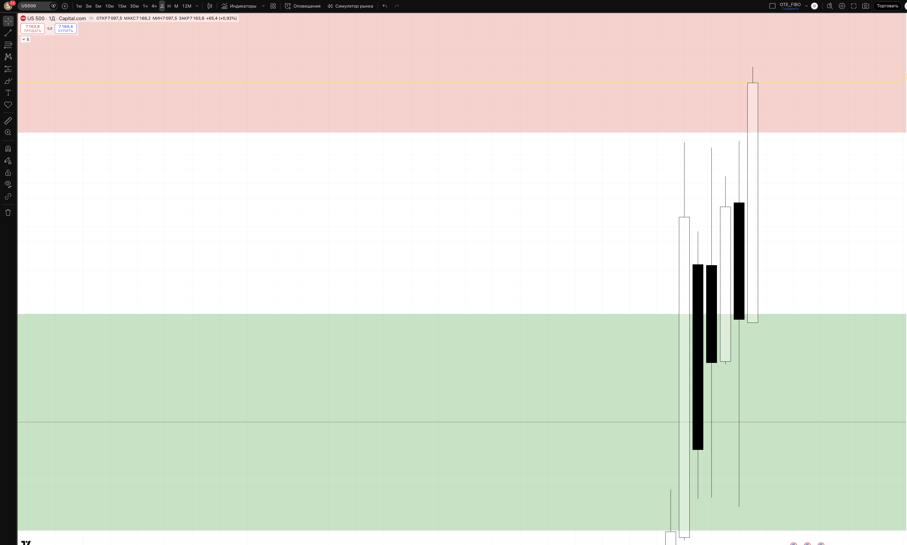
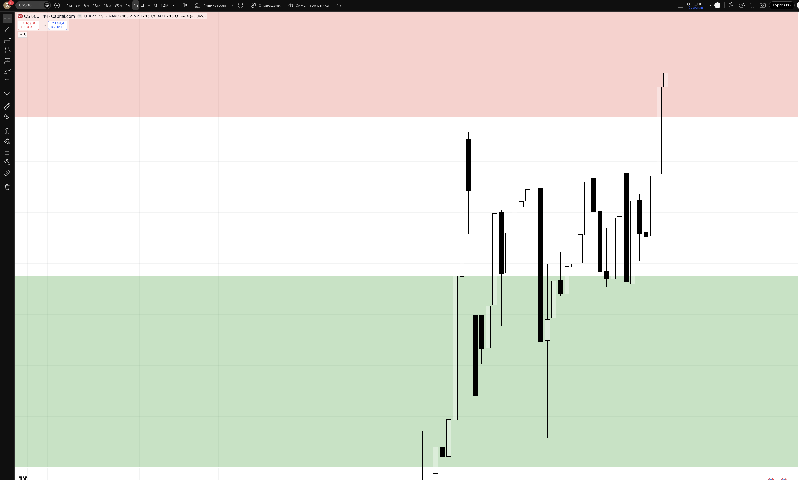
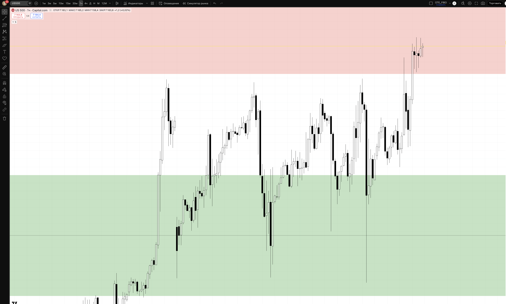
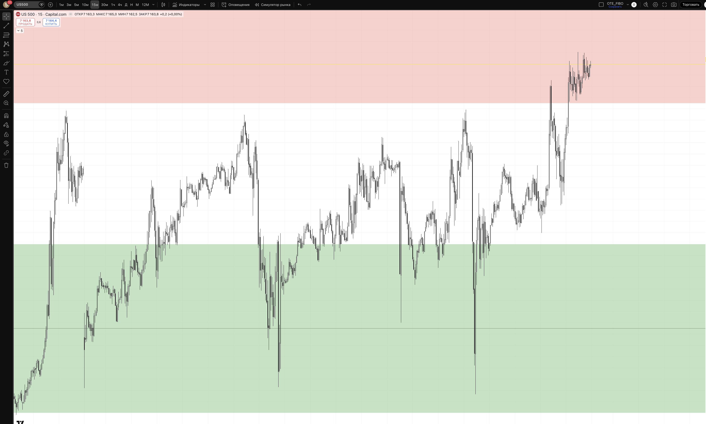

## 🎯 Пара: US500 (S&P 500) | Період: 27 квіт – 1 трав 2026
**Поточна ціна (Fri close):** 7163.8
**Стиль:** ⚡ ТІЛЬКИ ДЕННА ТОРГІВЛЯ (intraday — закриття до кінця сесії)

---

## 📖 Читання ринку — що відбулось і куди рухаємось

### Звідки прийшли (контекст)

US500 (S&P 500) — найширший і найбільш "ринковий" американський індекс. Він включає 500 компаній і є основним барометром стану американської економіки. На відміну від US100 (tech-heavy), US500 більш збалансований: в ньому є фінанси, охорона здоров'я, промисловість, споживчий сектор поряд із технологіями.

У квітні 2026 S&P 500 відновився після тарифного шоку початку місяця. Низьке значення 6311 (1 квітня) стало локальним мінімумом кризи, після чого розпочалось V-подібне відновлення. Рушійні сили відновлення: зниження тарифної напруги, початок earnings season Q1 2026, ослаблення долара (допомагає мультинаціональним компаніям в S&P), стабільний ринок праці.

З 1 квітня (low 6311) до 25 квітня (high 7168) = **+857 пунктів (+13.6%) за 17 торгових днів**. Ринок закрився на нових кількарічних максимумах.

### Що відбулось минулого тижня

Тиждень W18 (21–25 квітня) — ще один bullish тиждень поспіль:

> Пн 7113.6 → Вт 7086.4 → Ср 7129.5 → Чт 7098.4 → Пт 7163.8

Структура тижня:
- **Понеділок** — відкрився з gap down від п'ятничного закриття 7126.7, відновився до 7113
- **Вівторок** — незначна корекція до 7049 (low), закриття 7086 — ринок тримає рівень вище 7040
- **Середа** — відновлення до 7129, підтвердження bullish bias
- **Четвер** — volatility тиждень: low 7046, але закриття 7098 — ринок поглинав продажі
- **П'ятниця** — фінальний bullish push: з 7097 до 7168 (new high!), закриття 7163.8

Характерна особливість W18: **мінімальна консолідація і постійна buying pressure**. Кожен dip викуповувався протягом того ж дня. Це класичний "institutional accumulation" паттерн — великі гравці накопичують перед наступним push.

### Де знаходимось зараз

Ціна закрила тиждень на 7163.8 — **на тижневому хаю**. Це найсильніший можливий сигнал bullish momentum: закриття прямо на максимумі = покупці домінують до останньої хвилини сесії.

Структура:
- **HH/HL** збережена: кожен тиждень новий вищий хай
- **No significant pullback**: від 6311 до 7163 — жодного серйозного корекційного тижня
- **Support 7040–7100**: зона де ринок кілька разів знаходив покупців (Вт low 7049, Чт low 7046)

### HTF Bias: 🟢 BULLISH (strong, near ATH)

S&P 500 є "ширшим" ринком і його bullish сигнал підтверджує загальний ринковий sentiment. Якщо US500 сильний — це означає що інституційні покупці активні не лише в tech (US100), але і в усіх секторах.

### Куди рухаємось далі

**Основний сценарій (60%) — LONG continuation після pullback:** ринок може показати ранню корекцію до support 7040–7100 на початку W18. Після поглинання цієї зони → continuation до 7200 (психологічний) і вище.

**Альтернатива (30%) — Мінімальний pullback і immediate continuation:** якщо ринок не дає deep dip → шукаємо M15 trigger вище 7168 (breakout continuation) або pullback лише до 7120–7140 (near-pivot).

**Ведмежий (10%) — Earnings розчарування + tech sell-off:** великі компанії звітують W18 (Meta, Microsoft, Apple). Якщо results disappointing → gap down. При H4 close < 7000 → переглядаємо bias.

---

## 📊 Скріншоти з зонами підтримки/опору

### 🟦 Daily — HTF структура + зони

**Що бачимо на чарті:**
V-подібне відновлення з 6311 до 7168 за 17 днів. Ринок закрив тиждень прямо на хаю — максимально bullish сигнал. Support zone (зелена) нижче — де W18 знаходив покупців. Demand (синя) — глибша підтримка для більш серйозного pullback.

- 🔴 BSL ZONE 7150–7250 — Поточний ATH + психологічний рівень 7200. При sweep вище → acceleration. При failure → короткострокова пауза.
- 🟡 PIVOT 7163.8 — Fri close = ATH. Ринок закрився на максимумі — bullish сигнал.
- 🟢 SUPPORT 7040–7100 — W18 intraweek lows. Тут ринок кілька разів відштовхувався вгору. PRIMARY LONG зона при dip.
- 🔵 DEMAND 6720–6850 — W16 highs / D bullish OB. Більш глибока підтримка при серйознішому pullback.
- 🔴 INVALIDATION 6400 — Bullish bias скасовано нижче цього рівня.

### 🟦 H4 — entry context

**Що бачимо на чарті:**
H4 показує структуру W18 детально: narrow range консолідація (Пн-Чт у 7040–7145) з постійним poглинанням dips. П'ятничний bullish push — нова HH. Support (зелена) добре видна — зона повторних bounce.

### 🟢 H1 — Intraday entries

**Що бачимо на чарті:**
H1 показує тижневий bullish momentum: кожен pullback на H1 поглинається покупцями. П'ятниця — фінальний bullish push без корекції. Для входу в понеділок чекаємо H1 demand zone або pullback до pivot перед наступним push.

### ⚡ M15 — Trigger TF

**Призначення:**
- **LONG trigger (pullback):** Ціна в 7040–7100 + SSL sweep + M15 BOS вгору → long
- **LONG trigger (breakout):** Ціна консолідується біля 7165 + M15 BOS вище 7170 → continuation long

---

## 🎯 Ключові рівні тижня

| Рівень | Ціна | Що це і чому важливо |
|--------|------|----------------------|
| 🎯 Psychological | 7200 | Круглий рівень. Наступна психологічна ціль |
| 🔴 BSL Zone | **7150–7250** | ATH + round number. Reaction expected |
| 🟡 PIVOT | **7163.8** | Fri close = ATH. Bullish close прямо на хаю |
| 🟢 Support | **7040–7100** | W18 multi-touch support. PRIMARY LONG зона |
| 🔵 Demand | **6720–6850** | W16 highs / D OB. Глибша підтримка |
| 🔴 Invalidation | 6400 | Bullish bias скасовано |

---

## 💡 Тижневі сценарії

### Сценарій A — LONG з pullback до support (~60%) — ОСНОВНИЙ
Понеділок (або Asian/London) тягне до 7040–7100 → SSL sweep → M15 BOS вгору → long. Ціль: 7163 → 7200 → 7250. Підтримується: bullish momentum, закриття на хаю, сильна buying pressure протягом W18.

### Сценарій B — Breakout continuation (~30%)
Ринок не дає deep pullback. Понеділок консолідується 7140–7160 → M15 BOS вище 7170 → long. Менший потенціал, але momentum торгівля. Ціль: 7200 → 7250.

### Сценарій C — Earnings gap down (~10%)
Слабкі earnings від Meta/MSFT/Apple → gap down. Якщо H4 close < 7000 → стоїмо осторонь. Short тільки при H4 BOS вниз < 6850.

---

## ⚡ INTRADAY TRADE PLAN — ПОНЕДІЛОК (28 квіт)

### 🟢 SETUP 1 (PRIORITY) — LONG з pullback до support
**Сесія:** NY open 16:30–18:30 EET

**Логіка:** Після тижня bullish закриття на хаю ринок може дати early Monday pullback. NY відкриття — головний каталізатор. Якщо pullback до support → buying pressure відновлюється → long continuation до 7200+.

| Параметр | Значення |
|----------|---------|
| **Trigger** | Ціна в 7040–7100 + SSL sweep + M15 BOS вгору |
| **Entry** | 7060–7080 (ретест support зверху) |
| **SL** | 6980 (-100 pts / ~-$100) |
| **TP1 (30%)** | 7163.8 (+90 pts) → BE |
| **TP2 (50%)** | 7200 (+130 pts) RR 1:1.3 |
| **TP3 (20%)** | 7260 (+190 pts) RR 1:1.9 |
| **Lot** | **~0.20** |
| **Close by** | NY close 22:00 EET |

> Pip value US500: ~$1 per point per 0.01 lot (Capital.com/broker dependent). Lot ≈ $100 / (100 × $1 / 0.01 × 0.01) = 0.20 approx. Перевір у брокера точний контракт.

### 🔵 SETUP 2 (FALLBACK) — Breakout continuation
**Активується якщо:** ціна тримається над 7140 + M15 BOS вище 7170

| Параметр | Значення |
|----------|---------|
| **Entry** | 7170–7185 (після M15 BOS + ретест) |
| **SL** | 7080 (-100 pts) |
| **TP1** | 7220 (+40 pts) → BE |
| **TP2** | 7270 (+90 pts) RR 1:0.9 |
| **Lot** | 0.20 |

---

## ⏱ Тайминг сесій (intraday only)

| Сесія | UTC | EET | Дія |
|-------|-----|-----|-----|
| Pre-market | до 13:30 | до 16:30 | 📋 mark only |
| **NY open** | 13:30–15:30 | 16:30–18:30 | 🎯 PRIMARY entry |
| NY | 15:30–17:00 | 18:30–20:00 | менеджмент / TP |
| ❌ Late NY | > 17:00 | > 20:00 | no new entries |
| 🚫 Force close | 21:00 | 00:00 (Tue) | exit all |

> 📌 **EARNINGS WEEK:** Meta (Tue Apr 29 after-market), Microsoft (Wed Apr 30 after-market), Apple (Thu May 1 after-market). Очікуй підвищену volatility. Зменш розмір позиції або пропускай сесії в день earnings announcement.

---

## 🚨 Risk management

- 1% / угоду = $100
- Daily DD limit: 3% = $300
- ❌ NO HOLD overnight (earnings gap ризик!)
- **ОСОБЛИВА ОБЕРЕЖНІСТЬ цього тижня:** Meta/MSFT/Apple/Amazon/Alphabet звітують — після кожного announcement може бути gap
- Pip value: залежить від брокера — перевір розмір контракту US500 перед входом

## ⚠️ Plan invalidation

| Подія | Дія |
|-------|-----|
| Tech earnings miss (Meta/MSFT/AAPL) | Gap down можливий. Чекаємо до NY open наступного дня |
| H4 close < 7000 | Support пробита. Bullish bias послаблений. Зменшуємо позиції |
| Fed hawkish surprise | Risk-off → S&P 500 може різко впасти |
| H4 close > 7200 | Acceleration вгору. Continuation без deep setup |

---

## 🔗 Пов'язані
- [[20-Trading/Analysis/2026-W18-Apr27-May01/US100/analysis]]
- [[20-Trading/Analysis/2026-W18-Apr27-May01/EURUSD/analysis]]
- [[20-Trading/TradingView-MCP-Guide]]

## 📎 Артефакти
- TV layout: 1uLQZkqh
- Скріншоти: ця папка
