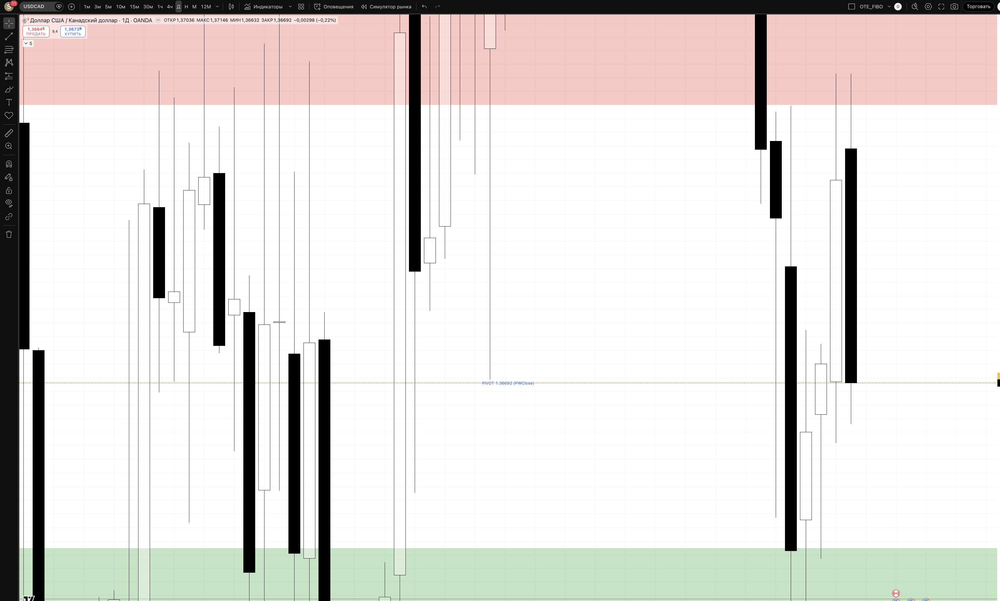
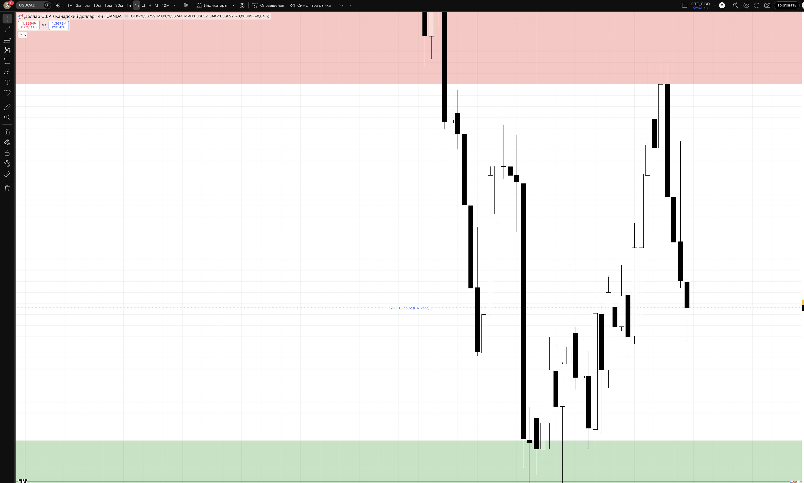
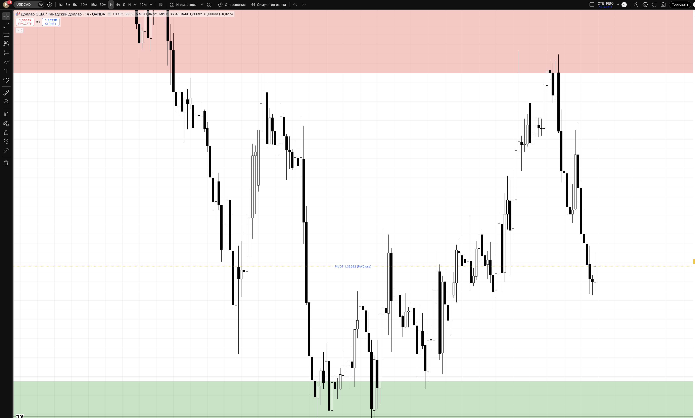
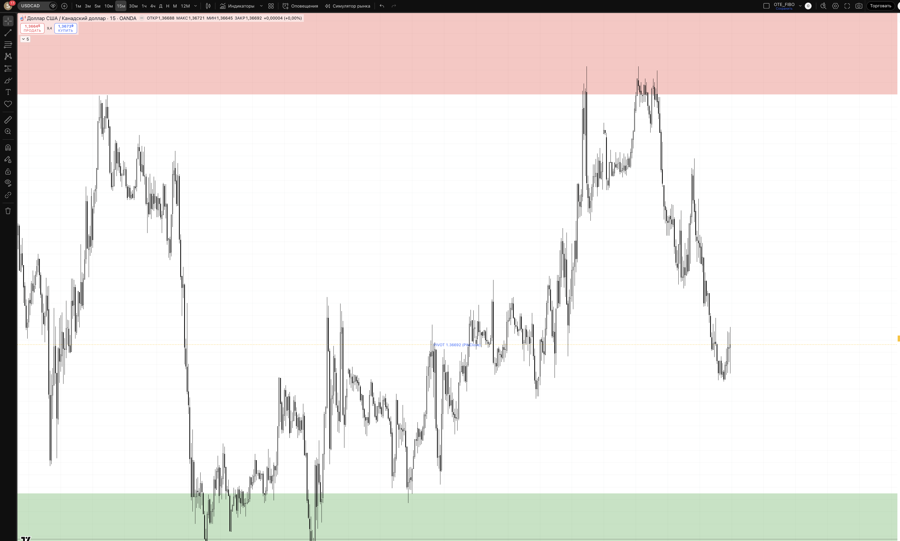

## 🎯 Пара: USDCAD | Період: 27 квіт – 1 трав 2026
**Поточна ціна (Fri close):** 1.36692
**Стиль:** ⚡ ТІЛЬКИ ДЕННА ТОРГІВЛЯ (intraday — закриття до кінця сесії)

---

## 📖 Читання ринку — що відбулось і куди рухаємось

### Звідки прийшли (контекст)

USDCAD знаходиться в одному з найсильніших bearish рухів серед усіх USD пар цього місяця. Починаючи з 3 квітня (хай 1.39670), пара впала до 1.36312 (22 квітня) — це **-336 pips за 15 торгових днів**. Рух обумовлений двома факторами одночасно:

1. **Слабкість USD** — DXY падає на фоні тарифних побоювань і зниження довіри до американських активів
2. **Сила CAD** — нафта WTI тримається вище $60, Канада відносно ізольована від тарифного конфлікту, Bank of Canada утримує ставку

Поєднання цих факторів дало USDCAD особливо сильне bearish давлення. Кожна корекція вверх (pullback) швидко поглиналась новими продавцями.

### Що відбулось минулого тижня

Тиждень W17 продовжив bearish тренд: пара відкрилась на 1.36863 і закрилась на 1.36446 (понеділок). Далі невелика консолідація — тиждень провів між 1.36312 та 1.37146.

**Структура тижня:**
- Нові 3-тижневі мінімуми: 1.36312 (вт), 1.36312 (сер), 1.36350 (пн)
- Максимуми тижня: 1.37146 (вт та чт) — ринок двічі відкинутий з цього рівня
- **П'ятниця:** рух від 1.37146 вниз до 1.36632, закриття 1.36692 — ведмежа свічка яка підтвердила тижневий bearish bias

Рівень 1.37146 став новим ключовим опором — він утримав двічі за тиждень. Це означає що продавці активні саме там.

### Де знаходимось зараз

Ціна закрила тиждень на 1.36692 — між resistance (1.371) та support cluster (1.363). Структура чітко bearish:
- **LL/LH** (нижчі лоу та нижчі хаю) на Daily — тренд вниз збережений
- Кожен pullback вверх стає меншим — sellers selling faster
- Momentum bearish: три тижні поспіль нові мінімуми

### HTF Bias: 🔴 BEARISH

USD слабкий, CAD відносно сильний. Поки 1.37500 не пробито вгору — bearish thesis діє.

### Куди рухаємось далі

**Основний сценарій (65%):** пара продовжує падати. Найближча ціль після пробою 1.36312 — зона 1.358–1.360 (major weekly support). Для цього потрібне підтвердження: тест і утримання під 1.363.

**Intraday підхід:** шукаємо SHORT на pullback вверх до resistance 1.371–1.374. Це дасть RR 1:2+ до нижніх таргетів.

**Альтернатива (25%):** Консолідація в рейнджі 1.363–1.374 ще тиждень перед наступним move. В такому разі торгуємо краї рейнджу.

**Invalidation (10%):** якщо H4 закривається вище 1.376 — bearish структура порушена. Можливий V-reversal вгору.

---

## 📊 Скріншоти з зонами підтримки/опору

### 🟦 Daily — HTF структура + зони

**Що бачимо на чарті:**
Чітка bearish тенденція: серія нижчих хаїв і нижчих лоу від початку квітня. Три тижні поспіль — нові мінімуми. PIVOT лінія (1.36692) в середньо-нижній частині. Resistance (червоний) — перешкода для відкату.

- 🔴 RESISTANCE 1.371–1.374 — колишня підтримка, тепер опір. Двічі відкинула ціну цього тижня. Тут SHORT.
- 🟡 PIVOT 1.36692 — Fri close, поточний рівень. При утриманні під ним — bearish продовження.
- 🟢 SUPPORT 1.363–1.3645 — недавні мінімуми. При пробої вниз → acceleration до Deep OTE.
- 🔵 DEEP OTE 1.358–1.360 — major weekly support. Ціль при breakdown.
- 🔴 INVALIDATION 1.376 — вище цього рівня bearish bias скасовано.

### 🟦 H4 — entry context

**Що бачимо на чарті:**
H4 показує серію bearish impulse барів і слабкі pullback-и. Кожен відкат (вгору) — коротший і слабший за попередній. Опір 1.371–1.374 добре видно: ціна підходила туди двічі і щоразу розворочувалась вниз без закриття вище.

### 🟢 H1 — Intraday entries

**Що бачимо на чарті:**
H1 показує останній тиждень детально: oscillation між 1.363 і 1.371. Видно як resistance zone (1.371+) чітко відкидає кожну спробу зростання. Для SHORT входу чекаємо саме цю зону.

Рівні для Setup 1 (short):
- 🔴 ENTRY 1.370–1.372 — у resistance зоні
- 🟢 SL 1.376 — вище invalidation
- TP1 1.367 (pivot) → TP2 1.363 (support) → TP3 1.359 (OTE)

### ⚡ M15 — Trigger TF

**Призначення:**
На M15 чекаємо trigger для SHORT:
- Ціна залазить у resistance 1.371–1.374
- **BSL sweep** — push вище 1.374 з миттєвим поверненням
- **BOS вниз** на M15 — свічка закривається нижче попереднього структурного лоу
- Тільки тоді → short на ретест resistance знизу

---

## 🎯 Ключові рівні тижня

| Рівень | Ціна | Що це і чому важливо |
|--------|------|----------------------|
| 🔴 Resistance | **1.371–1.374** | Ex-support, двічі відкинула ціну за тиждень. Основна SHORT зона |
| 🔴 Invalidation | 1.376 | Вище — bearish bias скасовано |
| 🟡 PIVOT | **1.36692** | Fri close. Утримання нижче → bearish продовження |
| 🟢 Support cluster | **1.363–1.3645** | Recent SSL. При пробої → acceleration |
| 🔵 Deep OTE | 1.358–1.360 | Ціль при breakdown. Major weekly support |

---

## 💡 Тижневі сценарії

### Сценарій A — SHORT з pullback до resistance (~65%) — ОСНОВНИЙ
Понеділок коригується вгору до 1.371–1.374 → BSL sweep → M15 BOS вниз → short. Ціль: 1.363 → 1.359. Підтримується: bearish тренд 3 тижні, слабкий USD, resistance відкидала ціну двічі поспіль.

### Сценарій B — Consolidation рейндж (~25%)
Пара тримається 1.363–1.374. Торгуємо краї: short на 1.371+, long bounce на 1.363 (дуже обережно — проти тренду).

### Сценарій C — Breakdown continuation (~10%)
Понеділок відразу пробиває 1.363 → short на ретест рівня. SL 1.369, TP 1.359–1.355.

---

## ⚡ INTRADAY TRADE PLAN — ПОНЕДІЛОК (28 квіт)

### 🔴 SETUP 1 (PRIORITY) — SHORT з resistance
**Сесія:** London KZ 10:00–12:00 EET

**Логіка:** Типова "sell the pullback" стратегія в bearish тренді. Чекаємо корекцію вгору — ринок повинен спершу "заправитися" ліквідністю (BSL sweep) перед наступним кроком вниз.

| Параметр | Значення |
|----------|---------|
| **Trigger** | Ціна в 1.371–1.374 + BSL sweep + M15 BOS вниз |
| **Entry** | 1.370–1.372 (ретест resistance зверху вниз) |
| **SL** | 1.376 (-40 pips / -$100) |
| **TP1 (30%)** | 1.36692 (+30p / +$75) → BE |
| **TP2 (50%)** | 1.363 (+70p / +$175) RR 1:1.75 |
| **TP3 (20%)** | 1.359 (+110p / +$275) RR 1:2.75 |
| **Lot** | **0.37** |
| **Close by** | NY close 22:00 EET |

> Pip value USDCAD ≈ $7.31/pip при 1.367. Lot = $100 / (40 × $7.31) ≈ 0.37

### 🟢 SETUP 2 (COUNTER-TREND) — LONG bounce з support
**Активується якщо:** ціна drop до 1.363 + SSL sweep + M15 BOS вгору

**Обережно! Проти тренду.** Тільки якщо strong bullish reaction + DXY rally.

| Параметр | Значення |
|----------|---------|
| **Entry** | 1.364–1.365 |
| **SL** | 1.360 (-40 pips) |
| **TP1** | 1.36692 (+30p) RR 1:0.75 → BE |
| **TP2** | 1.371 (+60p) RR 1:1.5 |
| **Lot** | 0.37 |

---

## ⏱ Тайминг сесій (intraday only)

| Сесія | UTC | EET | Дія |
|-------|-----|-----|-----|
| Asian range mark | до 07:00 | до 10:00 | 📋 mark only |
| **London KZ** | 07:00–09:00 | 10:00–12:00 | 🎯 PRIMARY entry |
| London | 09:00–12:00 | 12:00–15:00 | менеджмент |
| **NY KZ** | 12:00–14:00 | 15:00–17:00 | 🎯 SHORT lookout |
| NY | 14:00–17:00 | 17:00–20:00 | менеджмент / TP |
| ❌ Late NY | > 17:00 | > 20:00 | no new entries |
| 🚫 Force close | 21:00 | 00:00 (Tue) | exit all |

> 📌 Oil price та Canadian news (BOC speakers, trade data) можуть сильно впливати на CAD — перевіряти calendar перед входом.

---

## 🚨 Risk management

- 1% / угоду = $100
- Daily DD limit: 3% = $300
- ❌ NO HOLD overnight
- News check: BOC announcements, Oil inventory, US data — 30 хв до/після

## ⚠️ Plan invalidation

| Подія | Дія |
|-------|-----|
| H4 close > 1.376 | Bearish bias скасовано. Short — ні. Пауза. |
| Oil різко падає | CAD слабшає → USDCAD може рости. Перевірити correlation. |
| H4 close < 1.360 | Deep OTE пробитий, можливе прискорення вниз |

---

## 🔗 Пов'язані
- [[20-Trading/Analysis/2026-W18-Apr27-May01/EURUSD/analysis]]
- [[20-Trading/TradingView-MCP-Guide]]

## 📎 Артефакти
- TV layout: 1uLQZkqh
- Скріншоти: ця папка
