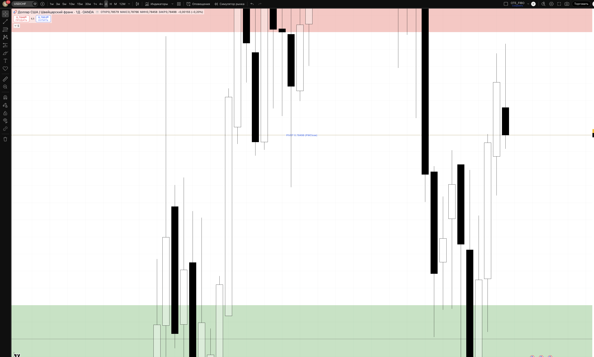
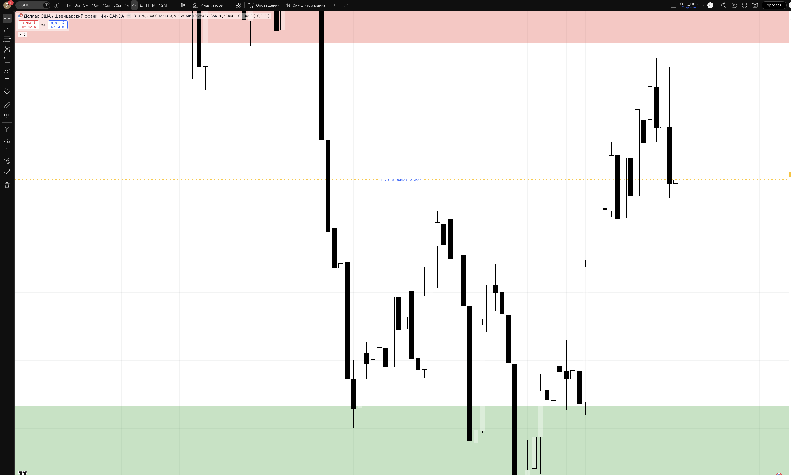
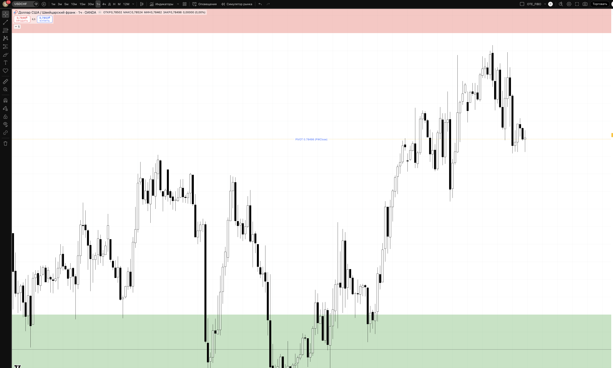
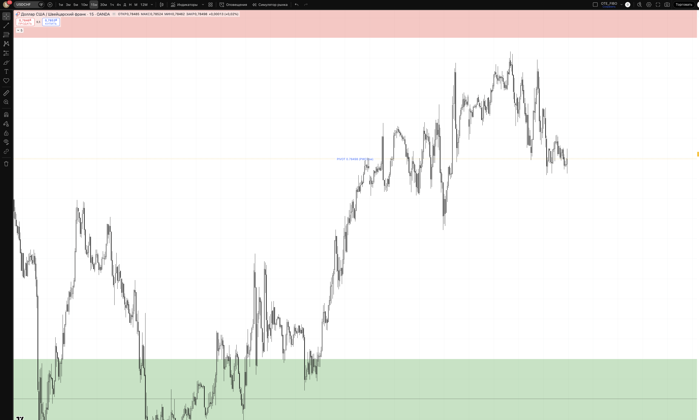

## 🎯 Пара: USDCHF | Період: 27 квіт – 1 трав 2026
**Поточна ціна (Fri close):** 0.78498
**Стиль:** ⚡ ТІЛЬКИ ДЕННА ТОРГІВЛЯ (intraday — закриття до кінця сесії)

---

## 📖 Читання ринку — що відбулось і куди рухаємось

### Звідки прийшли (контекст)

USDCHF — одна з найбільш "directional" пар цього кварталу. Франк є класичним safe-haven активом: коли ринки нервуються (тарифи, невизначеність), інвестори купують CHF, що тисне USDCHF вниз. Плюс до цього — загальна слабкість USD.

З початку квітня пара впала з 0.800–0.802 до 0.77753 (21 квітня) — це більше **-250 pips за 3 тижні**. Рух особливо різкий для пари яка зазвичай торгується повільно: 10 квітня денна свічка дала -83 pips (від 0.7988 до 0.7905), 13 квітня ще один агресивний спуск.

USDCHF є дзеркалом EURUSD — якщо EURUSD росте, USDCHF падає, і навпаки. Оскільки ми bullish на EURUSD, на USDCHF маємо bearish bias.

### Що відбулось минулого тижня

Мінімум тижня (і кількарічний мінімум пари): **0.77753** (понеділок 21 квітня). Після цього — 4 дні відновлення:

> 0.77843 → 0.78074 → 0.78476 → 0.78653 → 0.78498 (Fri close)

Цей 4-денний відскок (+80-90 pips від мінімуму) виглядає як технічне відновлення після перепроданості, а не фундаментальний розворот. Франк залишається структурно сильним.

**П'ятниця:** невелика корекція вниз від 0.78766 до закриття 0.78498 — ведмежий тиск повернувся наприкінці тижня, що підтверджує: rally може бути вичерпаним.

### Де знаходимось зараз

Ціна (0.78498) знаходиться між:
- Знизу: **DEMAND 0.778–0.780** — зона SSL sweep від 21 квітня
- Зверху: **RESISTANCE 0.788–0.792** — колишня підтримка, тепер опір + bearish OB

Поточний рівень — нейтральна зона. Ринок чекає підтвердження напрямку.

### HTF Bias: 🔴 BEARISH (з короткостроковою bullish корекцією)

Середньостроковий bias: bearish — USD слабкий, CHF сильний, тренд вниз.
Короткостроковий: пара відскочила від багаторічних мінімумів і може ще потестувати resistance перед відновленням падіння.

### Куди рухаємось далі

**Основний сценарій (55%) — SHORT з resistance:** пара продовжує поточний відскок до зони 0.788–0.792, де зустрічає продавців з медіум-терм позиціями. Після BSL sweep вгору та BOS вниз на M15 → short continuation.

**Альтернатива (30%) — Continuation нижче:** якщо пара відкривається вниз і одразу пробиває 0.778 → продовження до deep OTE 0.774–0.776.

**Контр-тренд LONG (15%):** Якщо 0.778–0.780 дає strong bullish reaction + BOS up → короткостроковий bounce до 0.785. **Обережно — проти тренду.**

---

## 📊 Скріншоти з зонами підтримки/опору

### 🟦 Daily — HTF структура + зони

**Що бачимо на чарті:**
Агресивне bearish падіння з 0.800 до 0.777 протягом трьох тижнів. П'ятничний PIVOT (0.785) — в зоні відскоку після мінімуму. Resistance зверху (червоний), Demand знизу (зелений).

- 🔴 RESISTANCE 0.788–0.792 — Ex-support, тепер bearish OB. Звідси очікуємо SHORT.
- 🟡 PIVOT 0.78498 — Fri close. Нейтральна зона між двома кластерами.
- 🟢 DEMAND 0.778–0.780 — SSL bounce зона від 21 квітня. LONG bounce тільки з підтвердженням.
- 🔵 DEEP OTE 0.774–0.776 — Абсолютний мінімум. Агресивний LONG лише при глибшому заході.
- 🔴 INVALIDATION 0.793 — Вище = bearish bias скасовано.

### 🟦 H4 — entry context

**Що бачимо на чарті:**
H4 детально показує: спадні impulse бари (Apr 10-21) → sweep мінімуму 0.77753 → 4 дні bullish корекції. Resistance зона (0.788–0.792) видна вгорі — саме туди направляється поточний відскок.

### 🟢 H1 — Intraday entries

**Що бачимо на чарті:**
H1 показує тижневий відскок детально. Видно як пара сформувала ChoCH (Change of Character) вгору від 0.777 і будує нові вищі лоу. Але наближення до resistance (0.788+) — сигнал що відскок може закінчитись.

### ⚡ M15 — Trigger TF

**Призначення:**
- **SHORT trigger:** Ціна в 0.788–0.792 + BSL sweep + M15 BOS вниз → short
- **LONG trigger:** Ціна drop до 0.778–0.780 + SSL sweep + M15 BOS вгору → counter-trend long

---

## 🎯 Ключові рівні тижня

| Рівень | Ціна | Що це і чому важливо |
|--------|------|----------------------|
| 🔴 Invalidation | 0.793 | Вище — bearish thesis закінчено |
| 🔴 Resistance | **0.788–0.792** | Bearish OB / ex-support. Очікуємо SHORT звідси |
| 🟡 PIVOT | **0.78498** | Fri close. Нейтральна зона |
| 🟢 Demand / SSL | **0.778–0.780** | Bounce зона. Counter-trend LONG з підтвердженням |
| 🔵 Deep OTE | 0.774–0.776 | Абсолютний мінімум. Агресивний LONG |

---

## 💡 Тижневі сценарії

### Сценарій A — SHORT з resistance (~55%) — ОСНОВНИЙ
Відскок продовжується до 0.788–0.792 → BSL sweep → M15 BOS вниз → short continuation. Ціль: 0.780 → 0.775. Підтримується: bearish тренд, EURUSD bullish, CHF safe-haven попит.

### Сценарій B — Breakdown continuation (~30%)
Понеділок відкривається вниз, пробиває 0.778 → short на ретест рівня. TP: 0.774–0.776.

### Сценарій C — Counter-trend LONG (~15%)
Дип до 0.778–0.780 + strong BOS up → bounce до 0.785–0.790. **Обережно — проти тренду.**

---

## ⚡ INTRADAY TRADE PLAN — ПОНЕДІЛОК (28 квіт)

### 🔴 SETUP 1 (PRIORITY) — SHORT з resistance
**Сесія:** London KZ 10:00–12:00 EET

**Логіка:** Відскок від мінімумів звичайно тестує опір і розвертається. При вході в resistance + sweep BSL → продавці повертаються.

| Параметр | Значення |
|----------|---------|
| **Trigger** | Ціна 0.788–0.792 + BSL sweep + M15 BOS вниз |
| **Entry** | 0.787–0.789 (ретест resistance знизу) |
| **SL** | 0.793 (-40–50 pips / -$100) |
| **TP1 (30%)** | 0.78498 (+30p) → BE |
| **TP2 (50%)** | 0.780 (+70–90p) RR 1:1.75 |
| **TP3 (20%)** | 0.775 (+120–140p) RR 1:3.0 |
| **Lot** | **0.28** |
| **Close by** | NY close 22:00 EET |

> Pip value USDCHF ≈ $12.74/pip. Lot = $100 / (40 × $12.74) ≈ 0.28

### 🟢 SETUP 2 (COUNTER-TREND) — LONG bounce
**Активується якщо:** ціна dips до 0.778–0.780 + SSL sweep + M15 BOS вгору

| Параметр | Значення |
|----------|---------|
| **Entry** | 0.780–0.781 |
| **SL** | 0.774 (-60 pips) |
| **TP1** | 0.785 (+40p) → BE |
| **TP2** | 0.789 (+80p) RR 1:1.3 |
| **Lot** | 0.22 |

---

## ⏱ Тайминг сесій (intraday only)

| Сесія | UTC | EET | Дія |
|-------|-----|-----|-----|
| Asian range mark | до 07:00 | до 10:00 | 📋 mark only |
| **London KZ** | 07:00–09:00 | 10:00–12:00 | 🎯 PRIMARY entry |
| London | 09:00–12:00 | 12:00–15:00 | менеджмент |
| **NY KZ** | 12:00–14:00 | 15:00–17:00 | 🎯 SECONDARY entry |
| NY | 14:00–17:00 | 17:00–20:00 | менеджмент / TP |
| ❌ Late NY | > 17:00 | > 20:00 | no new entries |
| 🚫 Force close | 21:00 | 00:00 (Tue) | exit all |

> 📌 SNB (Swiss National Bank) — може інтервенювати при різкому зміцненні франка. Перевіряти CHF news.

---

## 🚨 Risk management

- 1% / угоду = $100
- Daily DD limit: 3% = $300
- ❌ NO HOLD overnight
- News check: SNB, EURUSD кореляція, Safe-haven flows

## ⚠️ Plan invalidation

| Подія | Дія |
|-------|-----|
| H4 close > 0.793 | Bearish bias скасовано. Short — ні. |
| EURUSD різко падає | USDCHF може рости — перевірити кореляцію |
| SNB intervention news | Стоїмо осторонь |

---

## 🔗 Пов'язані
- [[20-Trading/Analysis/2026-W18-Apr27-May01/EURUSD/analysis]]
- [[20-Trading/TradingView-MCP-Guide]]

## 📎 Артефакти
- TV layout: 1uLQZkqh
- Скріншоти: ця папка
