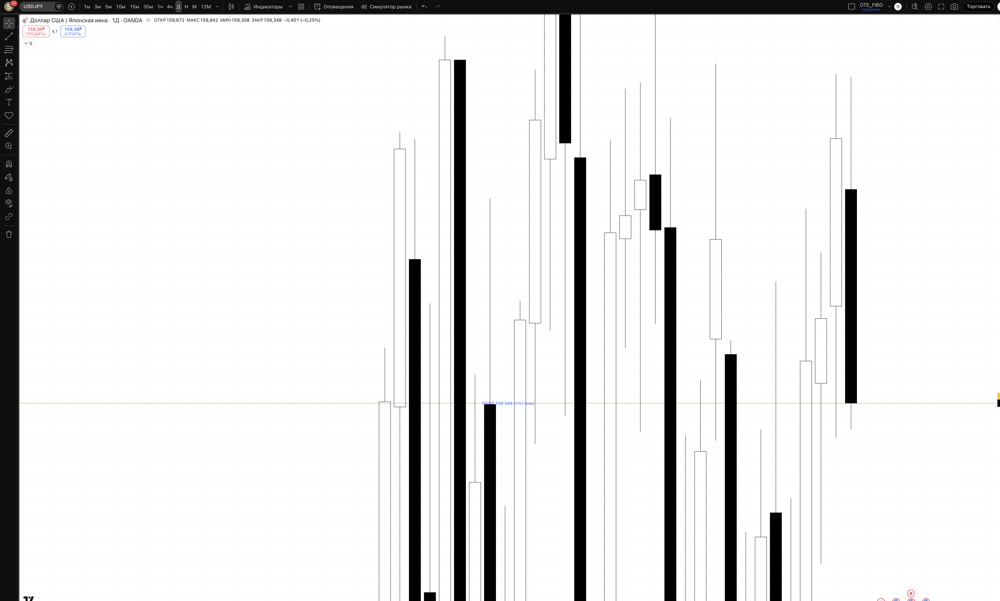
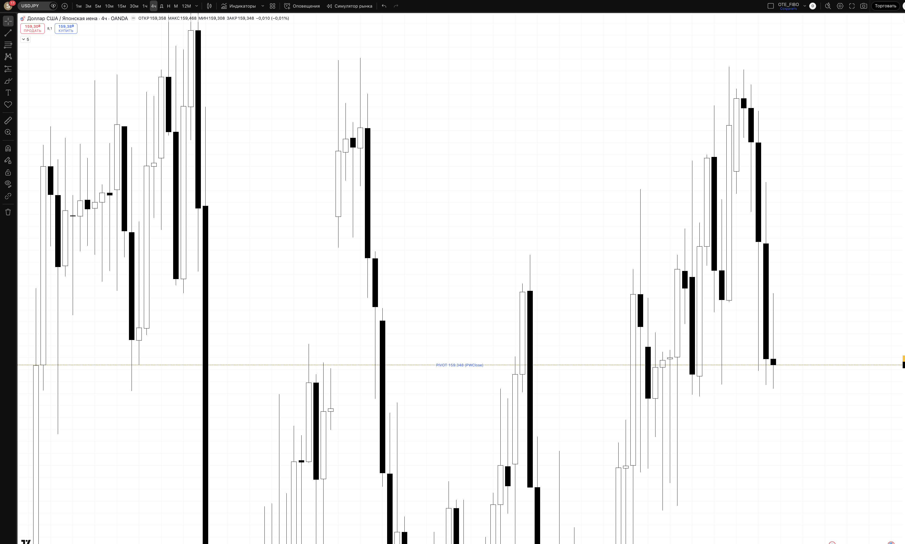
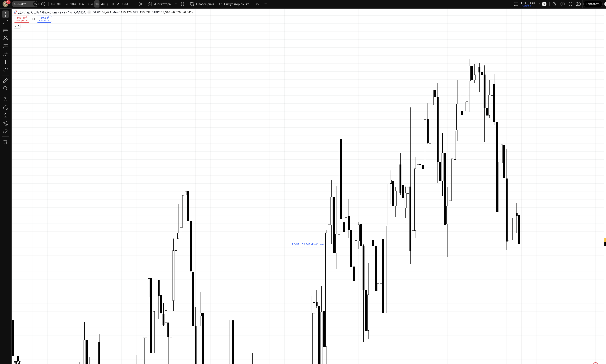
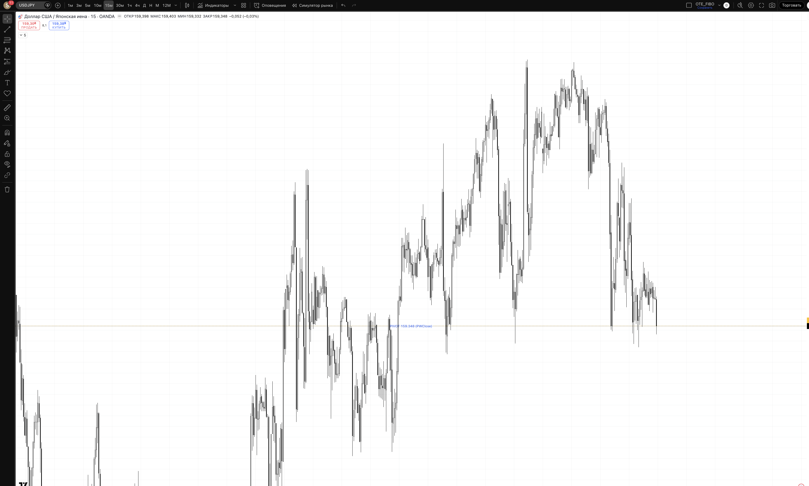

## 🎯 Пара: USDJPY | Період: 27 квіт – 1 трав 2026
**Поточна ціна (Fri close):** 159.348
**Стиль:** ⚡ ТІЛЬКИ ДЕННА ТОРГІВЛЯ (intraday — закриття до кінця сесії)

---

## 📖 Читання ринку — що відбулось і куди рухаємось

### Звідки прийшли (контекст)

USDJPY знаходиться в специфічній ситуації: пара в рейнджі вже кілька тижнів, але макро-фундаментал тисне вниз. Починаючи з березня, пара торгувалась в зоні 157.50–160.50. Ключові драйвери:

- **USD слабшає** — DXY падає на фоні тарифної невизначеності, зниження очікувань щодо Fed (ринок закладає більше знижень ставки, ніж Fed обіцяє)
- **JPY зміцнюється** — Bank of Japan все ближче до підвищення ставок, плюс Japanese investors repatriating funds

У березні пара показала різкий спуск до 157.51 (19 березня) — це був SSL sweep (зняття стопів під попередніми підтримками). Відскок стався швидко, але пара не змогла оновити вищі хаї — замість цього сформувала структуру LH (нижчий хай) відносно 160.464.

### Що відбулось минулого тижня

Тиждень W17 пройшов в режимі консолідації: пара ходила між 157.59 та 159.862, без чіткого directional руху. Кожна спроба пробити 159.86 зустрічала продавців, а спуски до 157.6-158.2 виявлялись короткочасними.

**П'ятниця (25 квіт):** пара закрилась на 159.348 після внутрідньої роботи між 159.308 та 159.842. Закриття — у верхній частині денного бару, але нижче ключової resistance зони (159.86-160.46). Показова нерішучість: ні бики, ні ведмеді не беруть контроль.

### Де знаходимось зараз

Пара застрягла між двома ключовими зонами:
- Зверху: **RESISTANCE 159.86–160.46** — BSL зона (стопи продавців накопичені там)
- Знизу: **DEMAND 158.20–158.55** — зона де пара кілька разів відскакувала (H4 multi-touch support)

Поточна ціна 159.348 — в нейтральній зоні між ними. **Це NOT-трейдована зона для інтрадей** — чекаємо або тест resistance, або тест demand.

### HTF Bias: ⚠️ RANGING / SLIGHT BEARISH

Структура незрозуміла для trend-follow торгівлі:
- Немає чітких HH/HL вверх, немає LL/LH вниз
- Macro фундаментал = bearish USDJPY (слабкий USD + сильний JPY)
- Але ціна не падає — ринок поглинає продажі
- Торгуємо ЕКСТРЕМИ рейнджу, не середину

### Куди рухаємось далі

**Сценарій A (SHORT, ~45%):** Понеділок відкривається і тестує resistance зону 159.86–160.00. Якщо ціна sweep BSL (push вище 160.00, але не закривається там) + BOS вниз на M15 → короткий вхід на ретест 159.70–159.80. Ціль: 159.35 (pivot) → 158.55 (demand).

**Сценарій B (LONG, ~35%):** Понеділок відкривається вниз і тестує demand 158.20–158.55 + SSL sweep нижче 157.75. Після BOS вверх на M15 → лонг на ретест 158.55–158.70. Ціль: 159.35 (pivot) → 159.86.

**Сценарій C (~20%):** Рейндж продовжується без тесту екстремів. **Стоїмо осторонь** — не входимо всередині рейнджу (між 158.55 і 159.86).

---

## 📊 Скріншоти з зонами підтримки/опору

### 🟦 Daily — HTF структура + зони

**Що бачимо на чарті:**
Пара в рейнджі між 157.5 і 160.5 протягом кількох тижнів. PIVOT лінія (жовта, 159.348) видна в середині. Resistance зона зверху, Demand знизу. Макро-контекст — bearish тиск від слабкого USD.

- 🔴 RESISTANCE 160.00–160.46 — BSL. Тут накопичені стопи продавців. При sweep → очікуємо reverse вниз.
- 🟡 PIVOT 159.348 — Fri close. Нейтральна зона, не торгуємо звідси.
- 🟢 DEMAND 158.20–158.55 — H4 multi-touch support. При sweep SSL → очікуємо reverse вгору.
- 🔵 DEEP OTE 157.50–157.75 — Тижневий SSL. Агресивний лонг при заході сюди.
- 🔴 INVALIDATION 156.00 — HTF структура зламана, yen повністю в контролі.

### 🟦 H4 — entry context

**Що бачимо на чарті:**
H4 показує структуру рейнджу детально: серія барів між 157.6 та 159.86. Кожен тест resistance завершувався відкатом, кожен тест demand давав відскок. PIVOT лінія видна як ключовий рівень де ціна часто консолідується.

### 🟢 H1 — Intraday entries

**Що бачимо на чарті:**
H1 показує тижневу консолідацію з нерішучими свічками. Добре видно: при підході до resistance (159.86+) — ведмежа реакція, при підході до demand (158.2-158.55) — бича реакція. Чекаємо тест одного з екстремів у понеділок.

### ⚡ M15 — Trigger TF

**Призначення:** На M15 чекаємо trigger:
- **SHORT trigger:** Push вище 160.00 (sweep BSL) + M15 BOS вниз — вхід short
- **LONG trigger:** Push нижче 157.75 (sweep SSL) + M15 BOS вверх — вхід long
- Без цих тригерів — не входимо

---

## 🎯 Ключові рівні тижня

| Рівень | Ціна | Що це і чому важливо |
|--------|------|----------------------|
| 🔴 BSL / PWH | 160.464 | Попередній тижневий хай. Накопичені стопи продавців |
| 🔴 Resistance | **159.86–160.00** | Зона відмови покупців. При sweep → short |
| 🟡 PIVOT | **159.348** | Fri close, нейтральна зона. Не торгуємо |
| 🟢 DEMAND | **158.20–158.55** | H4 multi-touch support. При sweep → long |
| 🔵 Deep SSL | 157.50–157.75 | Тижневий мінімум. Агресивний лонг |
| 🔴 Invalidation | 156.00 | HTF зламано, JPY в повному контролі |

---

## 💡 Тижневі сценарії

### Сценарій A — SHORT з resistance (~45%) — PREFERRED
Понеділок тестує 159.86–160.00 → sweep BSL → M15 BOS вниз → short на ретест 159.70–159.80. Цей сценарій підтримується слабким USD і ведмежою macro структурою. Ціль: 159.35 → 158.55.

### Сценарій B — LONG з demand (~35%)
Понеділок падає до 158.20–158.55 → sweep SSL → M15 BOS вгору → long. Цей сценарій можливий якщо USD несподівано зміцниться (news catalyst). Ціль: 159.35 → 159.86.

### Сценарій C — Середина рейнджу (~20%)
Пара консолідується між 158.55 і 159.86 весь день. **Стоїмо осторонь** — low probability setups, no trades.

---

## ⚡ INTRADAY TRADE PLAN — ПОНЕДІЛОК (28 квіт)

### 🔴 SETUP 1 (PREFERRED) — SHORT з resistance sweep
**Сесія:** London KZ або NY KZ (10:00–12:00 або 15:00–17:00 EET)

**Логіка:** USD слабкий → пара намагається відрости, але зустрічає продавців у resistance зоні. Sweep BSL вище 160.00 → різкий reverse. Короткий вхід з метою повернення в mid-range.

| Параметр | Значення |
|----------|---------|
| **Trigger** | Push > 160.00 + M15 BOS вниз (свічка закривається нижче структурного low) |
| **Entry** | 159.70–159.80 (ретест опору знизу) |
| **SL** | 160.50 (+50 pips / ~-$100) |
| **TP1 (40%)** | 159.348 (+35p) RR 1:0.7 → BE |
| **TP2 (40%)** | 158.55 (+115p) RR 1:2.3 |
| **TP3 (20%)** | 158.20 (+150p) RR 1:3.0 |
| **Lot** | **0.32** |
| **Close by** | NY close 22:00 EET |

### 🟢 SETUP 2 (FALLBACK) — LONG з demand sweep
**Активується якщо:** ціна падає нижче 157.75 + M15 BOS вгору

| Параметр | Значення |
|----------|---------|
| **Entry** | 158.55–158.70 (ретест demand зверху) |
| **SL** | 157.90 (-50 pips / ~-$100) |
| **TP1** | 159.348 (+65p) RR 1:1.3 |
| **TP2** | 159.86 (+115p) RR 1:2.3 |
| **Lot** | 0.32 |

> ⚠️ **Важливо для JPY пар:** pip value ≈ $6.29/pip при 159.00. Лот розраховано як $100 / (50 × $6.29) ≈ 0.32

---

## ⏱ Тайминг сесій (intraday only)

| Сесія | UTC | EET | Дія |
|-------|-----|-----|-----|
| Asian range mark | до 07:00 | до 10:00 | 📋 mark only (Tokyo active!) |
| **London KZ** | 07:00–09:00 | 10:00–12:00 | 🎯 PRIMARY entry |
| London | 09:00–12:00 | 12:00–15:00 | менеджмент |
| **NY KZ** | 12:00–14:00 | 15:00–17:00 | 🎯 SECONDARY entry |
| NY | 14:00–17:00 | 17:00–20:00 | менеджмент / TP |
| ❌ Late NY | > 17:00 | > 20:00 | no new entries |
| 🚫 Force close | 21:00 | 00:00 (Tue) | exit all |

> 📌 Asian сесія для JPY пар — ВАЖЛИВА. Tokyo (01:00–08:00 UTC) задає ранковий рейндж, який London KZ зазвичай sweep.

---

## 🚨 Risk management

- 1% / угоду = $100
- Daily DD limit: 3% = $300
- ❌ NO HOLD overnight
- News check: BOJ statements, Tokyo CPI, US GDP/PCE — пропускаємо 30 хв до/після

## ⚠️ Plan invalidation

| Подія | Дія |
|-------|-----|
| H4 close > 160.50 | Resistance пробита, short відмінено. Пауза. |
| H4 close < 157.50 | Demand пробита. Розглядаємо short continuation |
| BOJ unexpected statement | Стоїмо осторонь до прояснення |

---

## 🔗 Пов'язані
- [[20-Trading/Analysis/2026-W18-Apr27-May01/EURUSD/analysis]]
- [[20-Trading/TradingView-MCP-Guide]]

## 📎 Артефакти
- TV layout: 1uLQZkqh
- Скріншоти: ця папка
