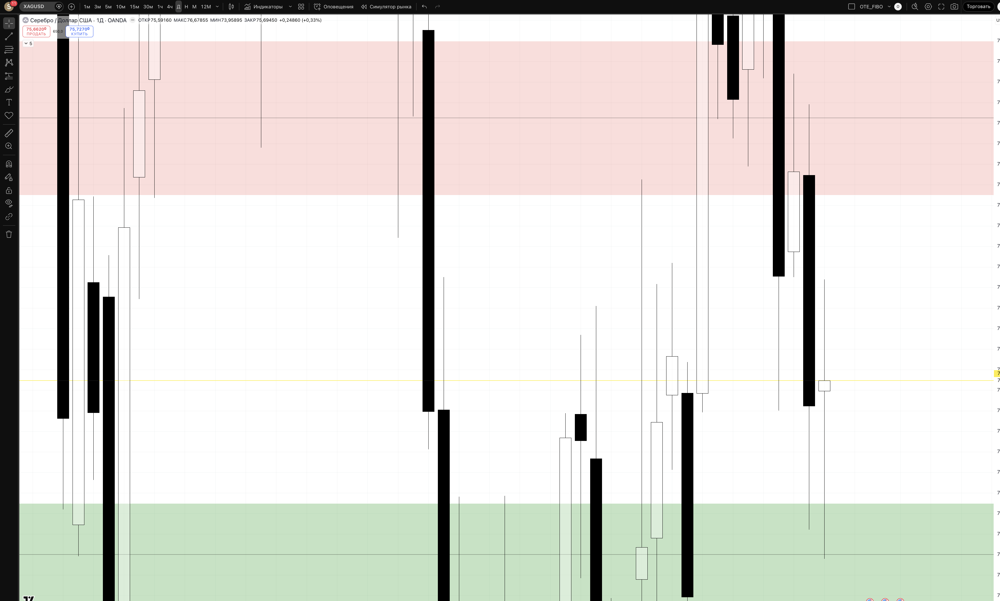
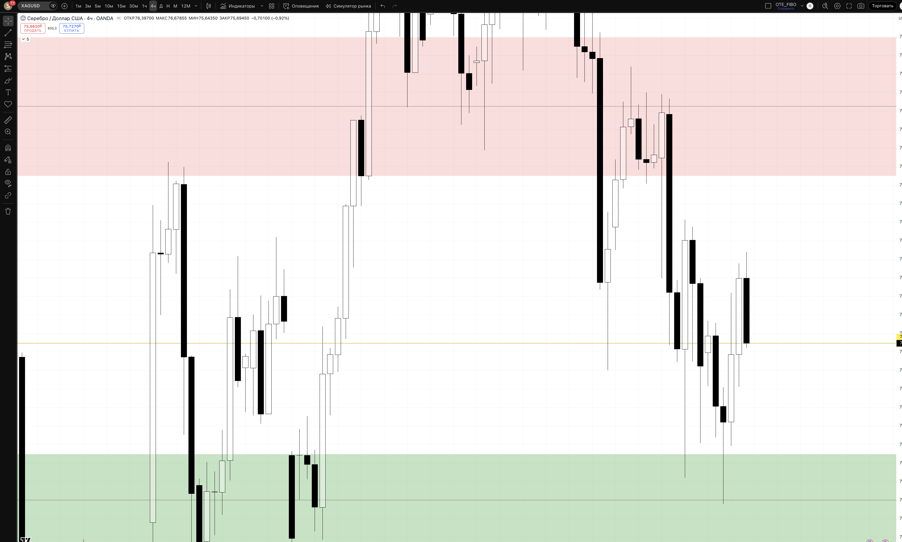
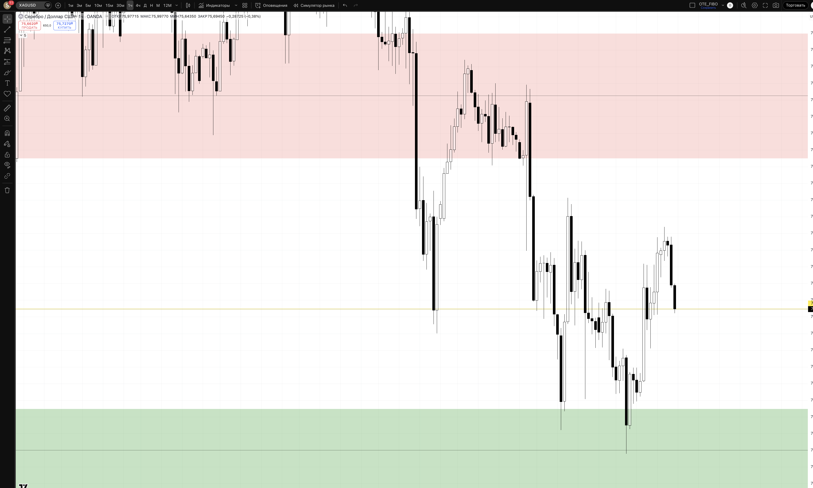
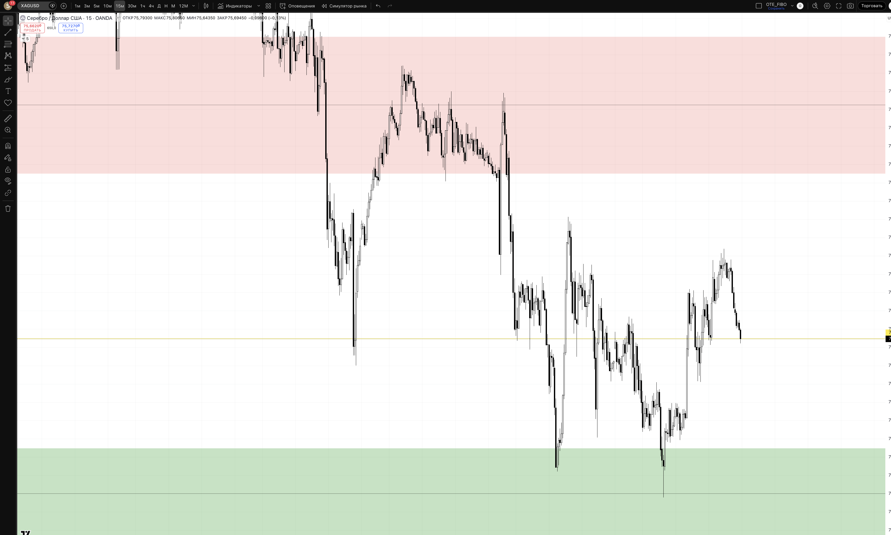

## 🎯 Пара: XAGUSD | Період: 27 квіт – 1 трав 2026
**Поточна ціна (Fri close):** 75.69
**Стиль:** ⚡ ТІЛЬКИ ДЕННА ТОРГІВЛЯ (intraday — закриття до кінця сесії)

---

## 📖 Читання ринку — що відбулось і куди рухаємось

### Звідки прийшли (контекст)

XAGUSD — срібло — є близьким побратимом золота і рухається синхронно з XAUUSD, але зі значно більшою волатильністю. Срібло має подвійний попит: як safe-haven актив (аналогічно золоту) і як промисловий метал (сонячні панелі, електроніка). Це означає що при bullish macro (слабкий USD, геополітика) срібло зростає ще сильніше за золото — але й корекції у нього глибші.

З кінця березня срібло провело масштабний bullish рух: від рівня 67-68 (28 березня) до абсолютного тижневого максимуму **83.06** (18 квітня 2026) — це приблизно **+15 доларів або +22% за три тижні**. Таке зростання відображає одночасно слабкість USD і зростання промислового попиту.

Чотири тижні поспіль нові максимуми: кожен тиждень закривався вище попереднього, доки ринок не досяг зони BSL (накопичені стопи продавців) у районі 80-83.

### Що відбулось минулого тижня

Тиждень W17 (21–25 квітня) став тижнем корекції після ATH 83.06:

> Пн 79.72 → Вт 76.71 (різкий спуск) → Ср 77.73 → Чт 75.45 → Пт 75.69

Ключові рухи тижня:
- **Понеділок** відкрився на рівні ATH-зони (~79.4), швидко знайшов продавців — денний high 80.68
- **Вівторок** — перший великий bearish день: з 79.87 до 76.71, хай лише 80.21 — ринок показав що resistance 80+ тримає
- **Середа-четвер** — продовження корекції з консолідацією, новий low 74.24 (четвер)
- **П'ятниця** — ціна досягла тижневого мінімуму 73.96, але закрилась на 75.69 — bullish відскок від demand zone у кінці сесії

Загальна корекція від ATH 83.06 до low 73.96 = **-9.1 долара або -11%** за тиждень. Для срібла це нормальна здорова корекція після такого сильного руху.

### Де знаходимось зараз

Ціна закрила тиждень на 75.69 — між двома ключовими зонами:
- Знизу: **DEMAND 73.5–74.5** — де тиждень знайшов дно і розвернувся (low 73.96)
- Зверху: **MINOR RES 77.5–79** — зона ex-support, яка тепер стала першим бар'єром
- Далі: **RESISTANCE 80.5–83** — зона ATH та BSL sweep ціль

Bullish структура збережена: HL (higher low) від 73.96 виступає новим структурним мінімумом тижня. Ринок показав що продавці не змогли закріпитись нижче 74 — bounce закрив тиждень значно вище низів.

### HTF Bias: 🟢 BULLISH (з корекційною паузою)

Macro: USD слабкий, промисловий попит на срібло стабільний, gold bullish → silver bullish. Корекція після ATH — нормальна ситуація, яка підготовлює ринок до нового руху вгору.

Структура: чотири тижні підряд — новий тижневий high. Поточний тиждень — перший "down week", але він не зламав bullish structure (HL збережено).

### Куди рухаємось далі

**Основний сценарій (60%) — LONG continuation:** пара відновлюється від demand 73.5–74.5. Тест minor resistance 77.5–79 → після пробою — шлях до ATH 80.5–83. Підтримується: macro bullish, збережена структура HH/HL, bounce від demand.

**Альтернатива (30%) — Consolidation range:** пара консолідується між 73.5 та 79 ще 1-2 тижні. Торгуємо краї: long від demand, обережний short від 79+.

**Ведмежий сценарій (10%) — Deep correction:** якщо пробивається 73.5 → наступна підтримка 70.5–72 (Deep OTE). LONG там з підтвердженням.

---

## 📊 Скріншоти з зонами підтримки/опору

### 🟦 Daily — HTF структура + зони

**Що бачимо на чарті:**
Виразний bullish тренд з масштабним зростанням до ATH 83.06. Тиждень корекції — нормальна "перезарядка" ринку. Demand zone (зелена) внизу витримала тиждень і дала відскок. Resistance (червона) зверху — ATH кластер.

- 🔴 RESISTANCE 80.5–83.0 — ATH / PWH / BSL. Тут накопичені стопи продавців і ордери на фіксацію прибутку. Ціль bullish руху. Очікуємо реакцію при підході.
- 🔴 MINOR RES 77.5–79 — Зона ex-підтримки (тут ринок консолідувався до ATH). Перший бар'єр для відновлення. При пробої вгору → acceleration.
- 🟡 PIVOT 75.69 — Fri close. Поточний рівень між demand та minor resistance.
- 🟢 DEMAND 73.5–74.5 — Зона тижневих мінімумів. Bounce стався від 73.96. PRIMARY зона для LONG.
- 🔵 DEEP OTE 70.5–72 — D bullish OB (Apr 7-8). Агресивний LONG при глибшому заході.
- 🔴 INVALIDATION 68 — Нижче — bullish bias скасовано.

### 🟦 H4 — entry context

**Що бачимо на чарті:**
H4 детально показує корекцію від ATH і формування HL в demand zone. Серія bearish H4 барів (Пн-Чт) → різкий bullish бар у п'ятницю від мінімуму 73.96. Це класична "sweep and recover" структура.

### 🟢 H1 — Intraday entries

**Що бачимо на чарті:**
H1 показує механіку п'ятничного відскоку: sweep нижче demand → BOS вгору на H1 → серія bullish свічок до закриття 75.69. ChoCH підтверджений. При поверненні до demand 73.5-74.5 на початку тижня — trigger для long входу.

### ⚡ M15 — Trigger TF

**Призначення:**
- **LONG trigger:** Ціна повертається до 73.5–74.5 + SSL sweep + M15 BOS вгору → long
- **Continuation trigger:** Ціна пробиває 77.5 на M15 + ретест → long continuation

---

## 🎯 Ключові рівні тижня

| Рівень | Ціна | Що це і чому важливо |
|--------|------|----------------------|
| 🔴 ATH / BSL | 83.06 | Абсолютний максимум (18 квіт). Ціль для BSL sweep |
| 🔴 Resistance | **80.5–83.0** | ATH кластер. Реакція продавців при підході |
| 🔴 Minor Res | **77.5–79** | Ex-support. Перший бар'єр відновлення |
| 🟡 PIVOT | **75.69** | Fri close. Нейтральна зона між двома кластерами |
| 🟢 Demand | **73.5–74.5** | Тижнева bounce зона. PRIMARY LONG при поверненні |
| 🔵 Deep OTE | 70.5–72 | D bullish OB. Агресивний LONG |
| 🔴 Invalidation | 68 | Bullish bias скасовано |

---

## 💡 Тижневі сценарії

### Сценарій A — LONG з demand (~60%) — ОСНОВНИЙ
Пара робить дип до 73.5–74.5 на початку тижня → SSL sweep → M15 BOS вгору → long. Ціль: 77.5 → 79 → 80.5. Підтримується: bullish структура збережена, bounce від demand на минулому тижні, macro tailwinds (срібло + золото bullish).

### Сценарій B — Consolidation між 73.5 та 79 (~30%)
Пара торгується в рейнджі без тесту extreme. Торгуємо краї: long від 73.5–74.5, обережний short від 79+. RR обмежений, але передбачувані точки.

### Сценарій C — Deep correction (~10%)
Пробій 73.5 → deep OTE 70.5–72. Long там з strong H1 BOS вгору. SL під 70. TP: 73.5 → 75.69.

---

## ⚡ INTRADAY TRADE PLAN — ПОНЕДІЛОК (28 квіт)

### 🟢 SETUP 1 (PRIORITY) — LONG з demand
**Сесія:** London KZ 10:00–12:00 EET або NY KZ 15:00–17:00 EET

**Логіка:** Після тижня корекції ринок може ще раз тестувати demand зону (або Asian сесія вже поштовхне до неї). SSL sweep під 73.96 + BOS вгору на M15 → long до minor resistance.

| Параметр | Значення |
|----------|---------|
| **Trigger** | Ціна в 73.5–74.5 + SSL sweep + M15 BOS вгору |
| **Entry** | 74.2–74.6 (ретест demand зверху) |
| **SL** | 72.8 (-$1.50 / -$100) |
| **TP1 (30%)** | 75.69 (+$1.2) → BE |
| **TP2 (50%)** | 77.5 (+$3.0) RR 1:2.0 |
| **TP3 (20%)** | 79.0 (+$4.5) RR 1:3.0 |
| **Lot** | **0.07** |
| **Close by** | NY close 22:00 EET |

> Pip value XAGUSD ≈ $50 per $1 per 0.01 lot (1 стандарт лот = 5000 oz). Lot = $100 / ($1.50 × $50 / 0.01) = 0.07 міні-лотів.
> Перевір у свого брокера точний розмір контракту перед входом.

### 🔵 SETUP 2 (FALLBACK) — Continuation long
**Активується якщо:** ціна тримається над 75.69 + BOS вгору на H1 вище 76.50

| Параметр | Значення |
|----------|---------|
| **Entry** | 75.7–76.0 (ретест до PIVOT) |
| **SL** | 74.5 (-$1.5) |
| **TP1** | 77.5 (+$1.6) → BE |
| **TP2** | 79.0 (+$3.0) RR 1:2.0 |
| **Lot** | 0.07 |

---

## ⏱ Тайминг сесій (intraday only)

| Сесія | UTC | EET | Дія |
|-------|-----|-----|-----|
| Asian range mark | до 07:00 | до 10:00 | 📋 mark only |
| **London KZ** | 07:00–09:00 | 10:00–12:00 | 🎯 PRIMARY entry |
| London | 09:00–12:00 | 12:00–15:00 | менеджмент |
| **NY KZ** | 12:00–14:00 | 15:00–17:00 | 🎯 SECONDARY entry |
| NY | 14:00–17:00 | 17:00–20:00 | менеджмент / TP |
| ❌ Late NY | > 17:00 | > 20:00 | no new entries |
| 🚫 Force close | 21:00 | 00:00 (Tue) | exit all |

> 📌 Срібло корелює з XAUUSD — завжди перевіряй золото перед входом. Якщо XAUUSD слабкий, XAGUSD теж під тиском.

---

## 🚨 Risk management

- 1% / угоду = $100
- Daily DD limit: 3% = $300
- ❌ NO HOLD overnight
- Перевір точний pip value для XAGUSD у свого брокера перед розрахунком лоту
- News check: XAUUSD рух, USD data, промислові звіти

## ⚠️ Plan invalidation

| Подія | Дія |
|-------|-----|
| H4 close < 72.8 | Demand пробита. Переходимо до Deep OTE сценарію |
| XAUUSD різко падає | Silver теж під тиском — не входимо до прояснення |
| H4 close > 79 | Minor resistance пробита. Long continuation без setup 1 |

---

## 🔗 Пов'язані
- [[20-Trading/Analysis/2026-W18-Apr27-May01/XAUUSD/analysis]]
- [[20-Trading/Analysis/2026-W18-Apr27-May01/EURUSD/analysis]]
- [[20-Trading/TradingView-MCP-Guide]]

## 📎 Артефакти
- TV layout: 1uLQZkqh
- Скріншоти: ця папка
