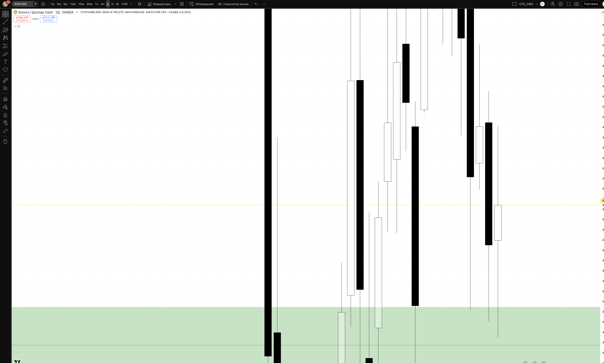
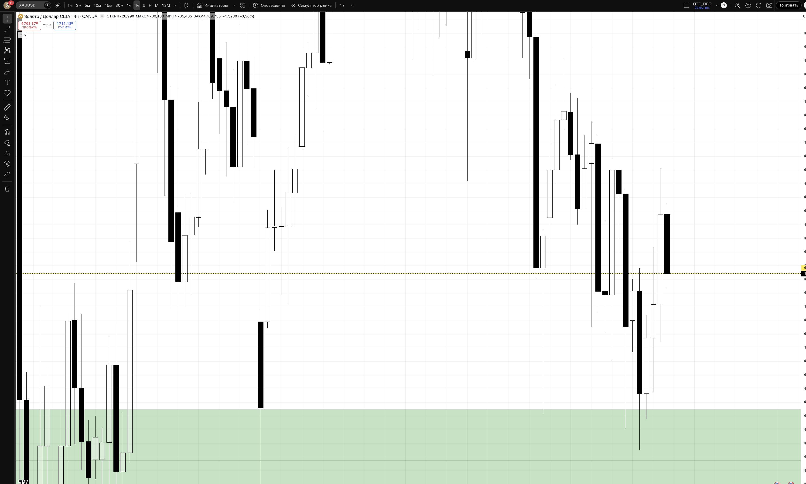
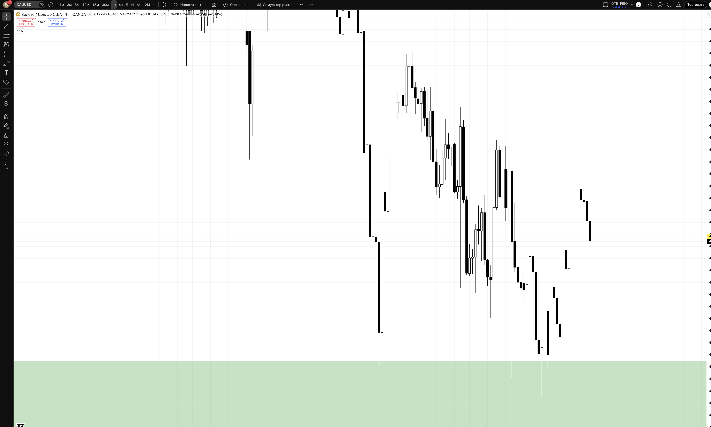
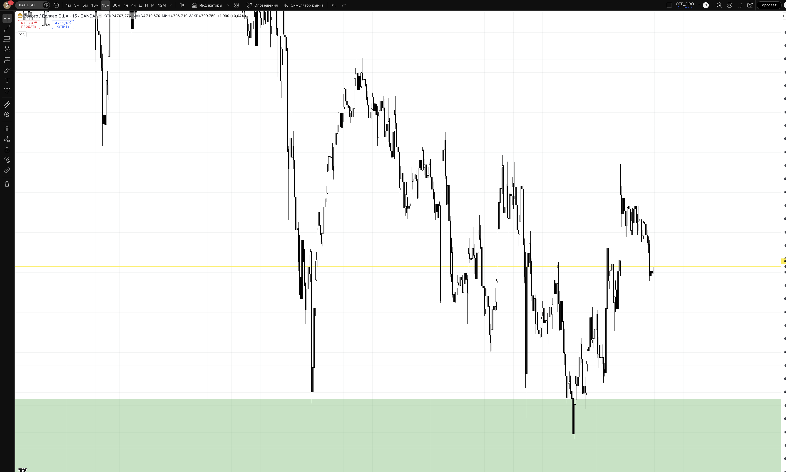

## 🎯 Пара: XAUUSD | Період: 27 квіт – 1 трав 2026
**Поточна ціна (Fri close):** 4709.75
**Стиль:** ⚡ ТІЛЬКИ ДЕННА ТОРГІВЛЯ (intraday — закриття до кінця сесії)

---

## 📖 Читання ринку — що відбулось і куди рухаємось

### Звідки прийшли (контекст)

XAUUSD — один з найбільш "trending" активів цього кварталу. Золото є класичним safe-haven інструментом і цього року воно б'є рекорди за рекордами. Рушійні сили: слабкість USD (DXY падає), геополітична напруга, тарифні побоювання, попит центральних банків на золото як резервний актив.

З початку квітня золото пройшло надзвичайний шлях: від рівня близько 3000–3100 (лютий-березень 2026) пара стрімко злетіла до абсолютного історичного максимуму **4891.54** (17 квітня 2026). Це більш ніж +1500-1800 пунктів за кілька тижнів — один із найбільших bullish рухів в золоті за останні роки.

На рівні 4891.54 ринок зустрів серйозний продавецький тиск: інституційні трейдери фіксували прибутки, а технічно ціна потрапила в зону де накопичені BSL (Buy Side Liquidity) — стопи продавців, які ставили шорти від нижчих рівнів.

### Що відбулось минулого тижня

Після досягнення ATH 4891.54 золото увійшло в фазу корекції:

> 4891.54 (ATH, 17 квіт) → корекція вниз → тиждень W17 показав мінімуми ~4658 (22 квітня) → відновлення закриття 4709.75 (п'ятниця, 25 квітня)

Корекція склала близько **-230 пунктів від ATH** (4891 → 4658). Це ~4.7% — здорова корекція для такого потужного bullish тренду. Структурно:

- Перші два дні тижня (понеділок-вівторок): продовження зниження від ATH, ринок шукає підтримку
- Середина тижня: консолідація та формування дна в районі 4640–4670 (зона попиту)
- П'ятниця: відскок до 4709.75 — ринок показав бичу реакцію від demand zone

**П'ятниця:** закриття на 4709.75 після тижневого мінімуму ~4658. Це +51 пункт відновлення від низів — ознака що продавці вичерпуються і покупці повертаються.

### Де знаходимось зараз

Ціна (4709.75) знаходиться між двома ключовими зонами:
- Знизу: **DEMAND 4640–4670** — зона де тиждень знайшов підтримку, bounce відбувся
- Зверху: **RESISTANCE 4820–4891** — зона ATH та попереднього тижневого хаю (BSL накопичення)

Поточний рівень — у нижній частині premium zone після корекції. Бичий тренд збережений: корекція залишилась всередині попереднього торгового рейнджу без пробою ключових структурних рівнів.

### HTF Bias: 🟢 BULLISH (з корекційною паузою)

Довгостроковий bias: bullish — золото в глобальному uptrendі, USD слабкий, попит на safe-haven активи зростає. Корекція після ATH — нормальна та здорова. Ринок готується до продовження bullish руху після перезарядки.

Короткостроковий: пара відновлюється від demand zone, наступна ціль — тест resistance 4820 і можливий новий ATH вище 4891.

### Куди рухаємось далі

**Основний сценарій (65%) — LONG continuation:** корекція завершилась у demand 4640–4670, ринок відновлюється. Після підтвердження на H4/H1 — long з цілями 4820 (resistance) → 4891 (ATH/BSL sweep). Підтримується: macro bullish bias, bounce від demand, збережена bullish structure.

**Альтернатива (25%) — Continuation consolidation:** пара торгується в рейнджі 4640–4820 ще 1-2 тижні. Торгуємо краї: long bounce від 4640–4670, short від 4820+ (обережно — проти тренду).

**Контр-тренд (10%) — Deep correction:** якщо пробивається 4640 → наступна підтримка 4553–4600 (Deep OTE / D bullish OB). Aggressive long там.

---

## 📊 Скріншоти з зонами підтримки/опору

### 🟦 Daily — HTF структура + зони

**Що бачимо на чарті:**
Виразний bullish тренд з масштабним зростанням до ATH 4891.54. Потім корекція і відновлення від demand zone. П'ятнична свічка — відскок від низів тижня. Resistance (червоний) зверху — ATH кластер, Demand (зелений) знизу — зона підтримки.

- 🔴 RESISTANCE 4820–4891 — ATH / PWH / BSL. Тут накопичені стопи продавців. Саме звідси ринок розвернувся тиждень тому. Очікуємо реакцію при повторному тесті.
- 🟡 PIVOT 4709.75 — Fri close. Поточний рівень — між demand та resistance.
- 🟢 DEMAND 4640–4670 — зона де тиждень знайшов дно. Тут bounce відбувся. PRIMARY зона для LONG при поверненні.
- 🔵 DEEP OTE 4553–4600 — D bullish OB. Агресивний LONG лише при глибшому заході.
- 🔴 INVALIDATION 4375 — Нижче цього рівня bullish bias скасовано.

### 🟦 H4 — entry context

**Що бачимо на чарті:**
H4 детально показує корекцію від ATH і формування дна в demand zone. Відскок з demand до PIVOT рівня — видно серію bullish H4 барів після мінімуму тижня. Resistance zone (4820+) — добре видно вгорі.

### 🟢 H1 — Intraday entries

**Що бачимо на чарті:**
H1 показує механіку п'ятничного відскоку: ціна знайшла підтримку в demand zone 4640–4670 і почала формувати вищі лоу. ChoCH вгору вказує на зміну короткострокового напрямку. Для long входу чекаємо підтвердження на H1 або нижчому TF.

### ⚡ M15 — Trigger TF

**Призначення:**
- **LONG trigger:** Ціна повертається до 4640–4670 + SSL sweep + M15 BOS вгору → long
- **SHORT trigger (контр-тренд):** Ціна в 4820–4891 + BSL sweep + M15 BOS вниз → short (обережно)

---

## 🎯 Ключові рівні тижня

| Рівень | Ціна | Що це і чому важливо |
|--------|------|----------------------|
| 🔴 ATH / BSL | 4891.54 | Абсолютний максимум. Накопичені стопи — ціль для BSL sweep |
| 🔴 Resistance | **4820–4891** | Зона ATH. Очікуємо реакцію при підході |
| 🟡 PIVOT | **4709.75** | Fri close. Поточний рівень між двома зонами |
| 🟢 Demand | **4640–4670** | Bounce зона мінімумів тижня. PRIMARY LONG зона |
| 🔵 Deep OTE | 4553–4600 | D bullish OB. Агресивний LONG при глибшому заході |
| 🔴 Invalidation | 4375 | Bullish bias скасовано нижче цього рівня |

---

## 💡 Тижневі сценарії

### Сценарій A — LONG continuation (~65%) — ОСНОВНИЙ
Пара тримається над 4640 і продовжує відновлення. London KZ дає pullback до demand або BOS вгору на H1 → long continuation. Ціль: 4820 → 4891 (ATH sweep). Підтримується: bullish тренд, bounce від demand, слабкий USD, macro tailwinds.

### Сценарій B — Consolidation (~25%)
Пара консолідується в рейнджі 4640–4820. Торгуємо краї: long від 4640–4670 (з підтвердженням), short від 4820+ (дуже обережно — проти тренду). RR обмежений, але передбачувані точки входу.

### Сценарій C — Deep correction (~10%)
Пробій нижче 4640 → наступна зона 4553–4600. Long лише з strong BOS вгору на H1. SL під 4540. TP: 4640 → 4709.

---

## ⚡ INTRADAY TRADE PLAN — ПОНЕДІЛОК (28 квіт)

### 🟢 SETUP 1 (PRIORITY) — LONG з demand
**Сесія:** London KZ 10:00–12:00 EET або NY KZ 15:00–17:00 EET

**Логіка:** Корекція від ATH знайшла підтримку в demand 4640–4670. Понеділок може дати повторний тест зони (SSL sweep) перед продовженням bullish руху. Після BOS вгору на M15 → long із потенціалом до 4820.

| Параметр | Значення |
|----------|---------|
| **Trigger** | Ціна 4640–4670 + SSL sweep + M15 BOS вгору |
| **Entry** | 4665–4680 (ретест demand зверху) |
| **SL** | 4625 (-50 pips / -$100) |
| **TP1 (30%)** | 4709.75 (+35p) → BE |
| **TP2 (50%)** | 4760 (+90p) RR 1:1.8 |
| **TP3 (20%)** | 4820 (+155p) RR 1:3.1 |
| **Lot** | **0.02** |
| **Close by** | NY close 22:00 EET |

> Pip value XAUUSD = $100 per $1 move per lot (1 lot = 100oz). Lot = $100 / (50 × $100) = 0.02 lot.
> 50 pips SL × $100/pip × 0.02 lot = $100 ризику.

### 🔵 SETUP 2 (FALLBACK) — LONG continuation без deep sweep
**Активується якщо:** ціна тримається над 4700 + BOS вгору на H1 вище 4730

| Параметр | Значення |
|----------|---------|
| **Entry** | 4710–4720 (H1 pullback до PIVOT) |
| **SL** | 4680 (-35p) |
| **TP1** | 4760 (+45p) → BE |
| **TP2** | 4820 (+100p) RR 1:2.8 |
| **Lot** | 0.03 |

---

## ⏱ Тайминг сесій (intraday only)

| Сесія | UTC | EET | Дія |
|-------|-----|-----|-----|
| Asian range mark | до 07:00 | до 10:00 | 📋 mark only |
| **London KZ** | 07:00–09:00 | 10:00–12:00 | 🎯 PRIMARY entry |
| London | 09:00–12:00 | 12:00–15:00 | менеджмент |
| **NY KZ** | 12:00–14:00 | 15:00–17:00 | 🎯 SECONDARY entry |
| NY | 14:00–17:00 | 17:00–20:00 | менеджмент / TP |
| ❌ Late NY | > 17:00 | > 20:00 | no new entries |
| 🚫 Force close | 21:00 | 00:00 (Tue) | exit all |

> 📌 Золото реагує на: USD рухи (DXY), геополітичні новини, Fed speakers, US Treasury yields. Перевіряти economic calendar перед входом.

---

## 🚨 Risk management

- 1% / угоду = $100
- Daily DD limit: 3% = $300
- ❌ NO HOLD overnight
- News check: Fed speakers, US GDP/PCE/NFP, геополітика
- Pip value: $100/pip per lot (1 lot = 100oz)

## ⚠️ Plan invalidation

| Подія | Дія |
|-------|-----|
| H4 close < 4625 | Demand пробита, стоп-лоси спрацювали. Переходимо до Deep OTE сценарію |
| H4 close > 4820 | Resistance пробита. Short — ні. Long continuation |
| Fed hawkish surprise | USD зміцниться → gold під тиском. Стоїмо осторонь |

---

## 🔗 Пов'язані
- [[20-Trading/Analysis/2026-W18-Apr27-May01/EURUSD/analysis]]
- [[20-Trading/TradingView-MCP-Guide]]

## 📎 Артефакти
- TV layout: 1uLQZkqh
- Скріншоти: ця папка
